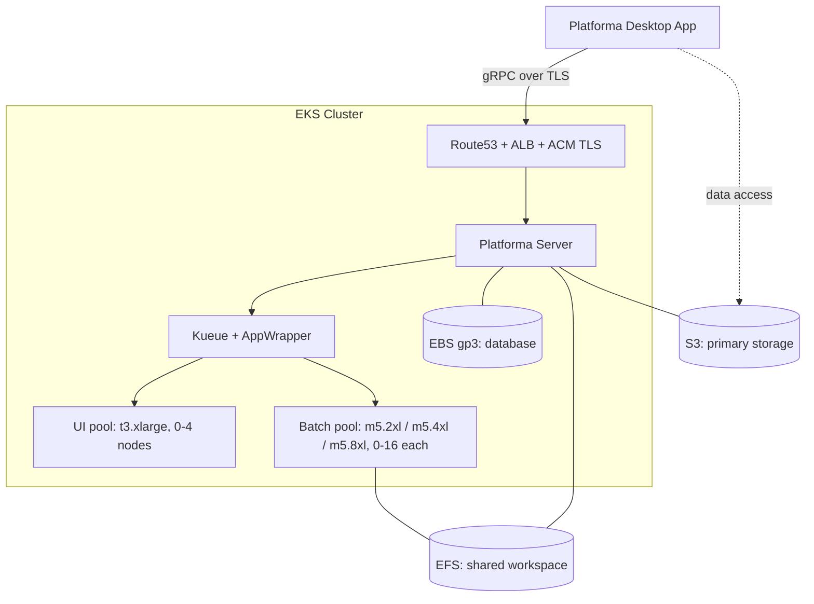
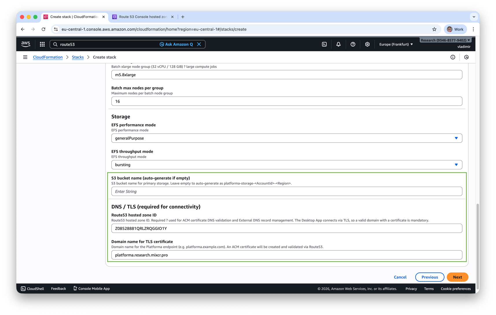
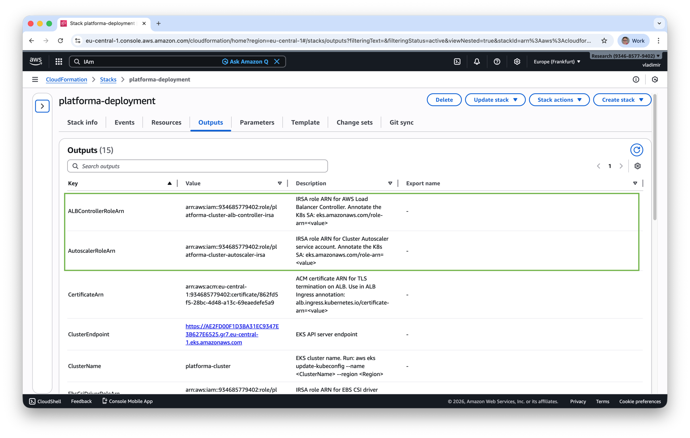
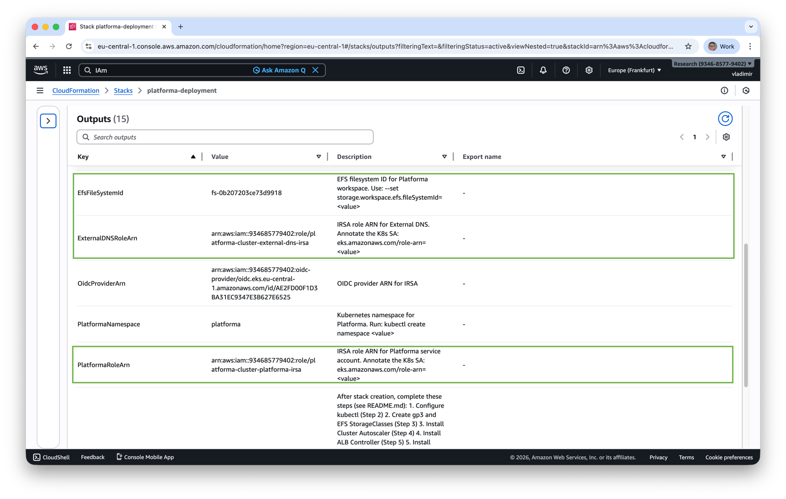
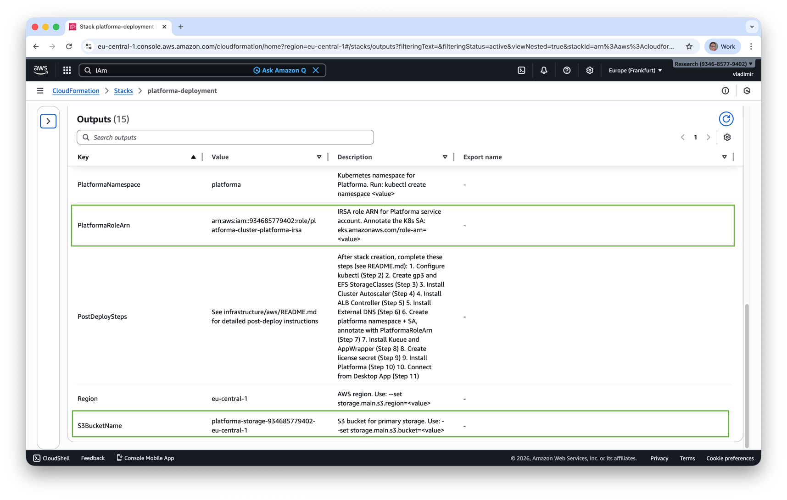
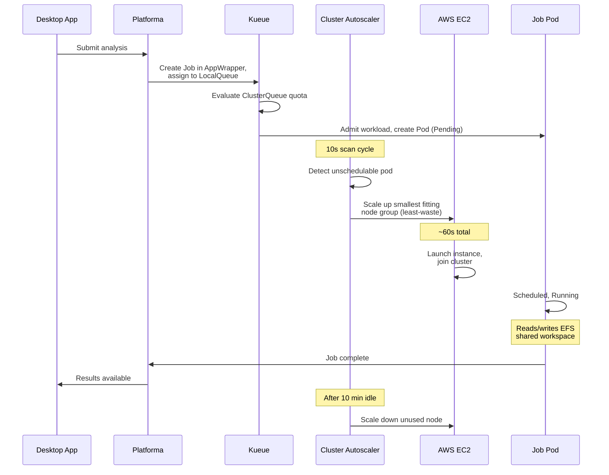

# Platforma on AWS EKS

Deploy Platforma on AWS using CloudFormation and Helm. You'll create the infrastructure through the AWS Console, install Kubernetes components from the CLI, then connect from the Platforma Desktop App.

> For manual CLI-only setup (without CloudFormation), see [Advanced installation](advanced-installation.md).

## Architecture



## What you'll do

The deployment has three phases:

**Phase 1 — AWS Console:** Deploy the CloudFormation stack. It creates the EKS cluster, node groups, EFS filesystem, S3 bucket, and all IAM roles. Takes ~15-20 minutes.

**Phase 2 — CLI:** Configure kubectl, then install Kueue and Platforma via Helm. The Platforma chart includes Cluster Autoscaler, ALB Controller, and External DNS as bundled sub-charts — all configured in a single `helm install`. Service accounts are created automatically; the namespace and license secret are created manually before the install (Steps 3-4).

**Phase 3 — Desktop App:** Download the Platforma Desktop App, connect to your cluster at `platforma.example.com`, and start running analyses.

## Prerequisites

- **This repository** — `git clone https://github.com/milaboratory/platforma-helm.git`; Steps 3 and 5 read files from `infrastructure/aws/`
- **AWS account** with permissions to create EKS, EFS, S3, IAM roles, ACM certificates (see [permissions.md](permissions.md))
- **Route53 hosted zone** with a registered domain (e.g. `example.com`) — the Desktop App connects only over TLS, so a domain and certificate are mandatory
- **Platforma license key**
- **CLI tools:** AWS CLI, kubectl v1.28+, Helm v3.12+ — CLI steps assume a Unix shell (bash or zsh); Windows users should use WSL or [AWS CloudShell](https://console.aws.amazon.com/cloudshell)
- **Platforma Desktop App** — download from [platforma.bio](https://platforma.bio) before starting

## Files in this directory

| File | Description |
|------|-------------|
| `cloudformation.yaml` | CloudFormation template (EKS + EFS + S3 + IAM) |
| `permissions.md` | AWS permissions reference for all components |
| `kueue-values.yaml` | Kueue Helm values with AppWrapper enabled |
| `values-aws-s3.yaml` | Platforma Helm values for AWS (S3 primary storage, recommended) |
| `advanced-installation.md` | Manual CLI setup guide (without CloudFormation) |
| `eksctl-cluster.yaml` | eksctl cluster config for advanced/manual EKS provisioning (see advanced-installation.md) |
| `domain-guide.md` | How to register a domain in AWS and set up Route53 |

---

## Step 1: Deploy CloudFormation stack

Open the AWS Console and navigate to **CloudFormation → Create Stack → With new resources**.

Upload `cloudformation.yaml` or paste its S3 URL, then fill in the parameters.


### Cluster parameters

| Parameter | Default | Description |
|-----------|---------|-------------|
| Cluster name | `platforma-cluster` | EKS cluster name |
| Kubernetes version | `1.31` | EKS version |
| Platforma namespace | `platforma` | K8s namespace (created later, used in IRSA trust). All CLI commands in this guide use the default `platforma`. If you change this parameter, use the same value in every `kubectl -n` and `helm install -n` command — the IRSA trust policies for all four service accounts are bound to this namespace, so any mismatch silently breaks AWS API access. |

### Networking

| Parameter | Default | Description |
|-----------|---------|-------------|
| VPC ID | *(empty = create new)* | Leave empty to create a new VPC, or provide an existing VPC ID |
| Private subnet IDs | *(leave as-is)* | 3 private subnets (one per AZ) — required if using existing VPC. The field shows `,,` by default — **do not clear it**; this is a CloudFormation technical workaround required when creating a new VPC. |
| Public subnet IDs | *(leave as-is)* | 3 public subnets — required for ALB when using existing VPC. Same `,,` workaround applies. |
| VPC CIDR | `10.0.0.0/16` | CIDR for the new VPC (ignored with existing VPC) |

### Node groups

Default values work for most deployments. Adjust batch instance types and max counts for your workload.

| Parameter | Default | Description |
|-----------|---------|-------------|
| System instance type | `t3.large` | Platforma server, Kueue, controllers |
| System node count | `2` | Fixed count |
| UI instance type | `t3.xlarge` | Interactive tasks |
| UI max nodes | `4` | Autoscales from 0 |
| UI always-on node | `false` | Keep 1 UI node running at all times (~$200/month, eliminates cold start) |
| Batch medium | `m5.2xlarge` | 8 vCPU / 32 GiB |
| Batch large | `m5.4xlarge` | 16 vCPU / 64 GiB |
| Batch xlarge | `m5.8xlarge` | 32 vCPU / 128 GiB |
| Batch max per group | `16` | Each batch tier scales 0 to this |

**UI node cold start:** When all UI nodes are at zero, the first task waits ~2-3 minutes for a t3.xlarge to launch and join the cluster. Setting **UI always-on node** to `true` keeps one node running permanently — tasks start instantly, but adds ~$200/month to your AWS bill.

### Storage

| Parameter | Default | Description |
|-----------|---------|-------------|
| EFS performance mode | `generalPurpose` | `maxIO` for very high throughput |
| EFS throughput mode | `bursting` | `elastic` for consistent high throughput |
| S3 bucket name | *(auto-generated)* | Auto-generates as `platforma-storage-<account>-<region>` |

### DNS / TLS (required)

| Parameter | Description |
|-----------|-------------|
| **Route53 hosted zone ID** | Your hosted zone ID (e.g. `Z0123456789ABCDEF`) |
| **Domain name** | Endpoint for Platforma (e.g. `platforma.example.com`) |

These are **required**. The Desktop App connects only over TLS and requires a real domain — it cannot use IP addresses or self-signed certificates.

**What this means:** You need a domain name you own (e.g. `platforma.example.com`) and a Route53 hosted zone for it. A hosted zone is Route53's way of managing DNS records for a domain. The stack requests an ACM certificate for your domain and validates it automatically by writing a DNS record to your hosted zone — no manual certificate steps.

If you don't have a domain yet, see [How to register a domain in AWS](domain-guide.md).



### Create the stack

Click **Create Stack**. The stack takes **~15-20 minutes**. Note the stack name you entered — you'll need it in the Cleanup section.

Once complete, go to the **Outputs** tab. The outputs below are used in the install commands. The stack also creates infrastructure outputs (OIDC provider, VPC, node group role, CSI driver roles) — the install commands don't reference them directly.





| Output | Used in |
|--------|---------|
| `ClusterName` | Step 2 (kubeconfig) |
| `Region` | Step 2, Step 5 |
| `EfsFileSystemId` | Step 5 (EFS StorageClass) |
| `S3BucketName` | Step 5 (Platforma install) |
| `AutoscalerRoleArn` | Step 5 |
| `ALBControllerRoleArn` | Step 5 |
| `ExternalDNSRoleArn` | Step 5 |
| `PlatformaRoleArn` | Step 5 |
| `CertificateArn` | Step 5 (ingress) |

---

## Step 2: Configure kubectl

First, authenticate your AWS CLI session. If you're not sure whether you're logged in, run:

```bash
aws sts get-caller-identity
```

If this fails, log in:

```bash
# Standard credentials — run `aws configure` once to set access key + secret key
aws configure

# SSO / IAM Identity Center
aws sso login --profile <your-profile>
export AWS_PROFILE=<your-profile>
```

Set `$REGION` from the CloudFormation Outputs before running the kubeconfig command:

```bash
CLUSTER_NAME=<ClusterName>   # from CloudFormation Outputs
REGION=<Region>               # from CloudFormation Outputs — also set in Step 5 variable block
aws eks update-kubeconfig --name $CLUSTER_NAME --region $REGION
```

Verify:

```bash
kubectl get nodes
```

You should see the number of system nodes you configured (2 by default). If the stack just completed, nodes may still be initializing — wait ~1 minute and retry if they show `NotReady`.

---

## Step 3: Install Kueue with AppWrapper support

Kueue manages job queuing and resource allocation. AppWrapper provides single-resource status monitoring with automatic retries.

`kueue-values.yaml` is included in the repository and pre-configured for Platforma — no edits needed.

```bash
cd platforma-helm/infrastructure/aws   # relative to where you ran git clone; use an absolute path if unsure, e.g. ~/platforma-helm/infrastructure/aws
helm install kueue oci://registry.k8s.io/kueue/charts/kueue \
  --version 0.16.1 \
  -n kueue-system --create-namespace \
  -f kueue-values.yaml
```

Wait for readiness:

```bash
kubectl wait --for=condition=Available deployment/kueue-controller-manager \
  -n kueue-system --timeout=120s
```

### Install AppWrapper CRD and controller

```bash
kubectl apply --server-side -f https://github.com/project-codeflare/appwrapper/releases/download/v1.1.2/install.yaml

kubectl wait --for=condition=Available deployment/appwrapper-controller-manager \
  -n appwrapper-system --timeout=120s
```

Verify:

```bash
kubectl get pods -n kueue-system
kubectl get pods -n appwrapper-system
```

---

## Step 4: Create namespace and license secret

The namespace must exist before `helm install` so the license secret is in place when Platforma starts.

```bash
kubectl create namespace platforma
kubectl create secret generic platforma-license \
  -n platforma \
  --from-literal=MI_LICENSE="your-license-key"
```

Replace `your-license-key` with your Platforma license key. The secret name (`platforma-license`) and key (`MI_LICENSE`) are required by the chart — do not change them.

---

## Step 5: Install Platforma

One `helm install` deploys Platforma and all infrastructure components: Cluster Autoscaler, ALB Controller, External DNS, and both StorageClasses (gp3 + EFS). It also creates the Kueue queue resources (ClusterQueues, LocalQueues, ResourceFlavors) that Platforma uses for job scheduling — these are configured by the `kueue` section in `values-aws-s3.yaml`. Service accounts are created automatically. The namespace must already exist — create it in Step 4 before running this command.

Switch to the `infrastructure/aws/` directory if not already there:

```bash
cd platforma-helm/infrastructure/aws   # relative to where you ran git clone; use an absolute path if unsure, e.g. ~/platforma-helm/infrastructure/aws
```

Fill in values from CloudFormation Outputs (nine variables) plus two you supply yourself (`DOMAIN` and `DOMAIN_FILTER`).

> **`DOMAIN_FILTER` must be set correctly.** It is the domain of your Route53 hosted zone — the zone External DNS writes DNS records into. For most users this is the registered domain root (e.g. `example.com`). If you created a dedicated hosted zone for a subdomain like `platforma.example.com`, use `platforma.example.com` instead. **Using the wrong value causes External DNS to silently skip record creation** — the cluster will appear healthy but the domain won't resolve.

> `CLUSTER_NAME` doubles as the External DNS `txtOwnerId` — a unique string written into TXT records so External DNS tracks which records it owns. If multiple clusters share a hosted zone, each must have a distinct cluster name.

```bash
# From CloudFormation Outputs tab:
CLUSTER_NAME=<ClusterName>   # must match the name used in the Step 2 kubeconfig command
REGION=<Region>   # from CloudFormation Outputs
EFS_ID=<EfsFileSystemId>
S3_BUCKET=<S3BucketName>
CERTIFICATE_ARN=<CertificateArn>
PLATFORMA_ROLE_ARN=<PlatformaRoleArn>
AUTOSCALER_ROLE_ARN=<AutoscalerRoleArn>
ALB_ROLE_ARN=<ALBControllerRoleArn>
EXTERNALDNS_ROLE_ARN=<ExternalDNSRoleArn>

# Not in Outputs — same values you entered as stack parameters:
DOMAIN=<the domain you entered, e.g. platforma.example.com>
DOMAIN_FILTER=<your Route53 hosted zone domain, e.g. example.com>   # see note above

helm install platforma oci://ghcr.io/milaboratory/platforma-helm/platforma \
  --version 3.0.0 \
  -n platforma \
  -f values-aws-s3.yaml \
  \
  --set storage.main.s3.bucket=$S3_BUCKET \
  --set storage.main.s3.region=$REGION \
  --set "serviceAccount.annotations.eks\.amazonaws\.com/role-arn=$PLATFORMA_ROLE_ARN" \
  \
  --set storageClasses.efs.fileSystemId=$EFS_ID \
  \
  --set cluster-autoscaler.autoDiscovery.clusterName=$CLUSTER_NAME \
  --set cluster-autoscaler.awsRegion=$REGION \
  --set "cluster-autoscaler.rbac.serviceAccount.annotations.eks\.amazonaws\.com/role-arn=$AUTOSCALER_ROLE_ARN" \
  \
  --set aws-load-balancer-controller.clusterName=$CLUSTER_NAME \
  --set aws-load-balancer-controller.region=$REGION \
  --set "aws-load-balancer-controller.serviceAccount.annotations.eks\.amazonaws\.com/role-arn=$ALB_ROLE_ARN" \
  \
  --set external-dns.domainFilters[0]=$DOMAIN_FILTER \
  --set external-dns.txtOwnerId=$CLUSTER_NAME \
  --set "external-dns.serviceAccount.annotations.eks\.amazonaws\.com/role-arn=$EXTERNALDNS_ROLE_ARN" \
  \
  --set ingress.enabled=true \
  --set ingress.className=alb \
  --set ingress.api.host=$DOMAIN \
  --set ingress.api.tls.enabled=true \
  --set ingress.api.annotations."alb\.ingress\.kubernetes\.io/scheme"=internet-facing \
  --set ingress.api.annotations."alb\.ingress\.kubernetes\.io/target-type"=ip \
  --set-json 'ingress.api.annotations.alb\.ingress\.kubernetes\.io/listen-ports=[{"HTTPS":443}]' \
  --set ingress.api.annotations."alb\.ingress\.kubernetes\.io/certificate-arn"=$CERTIFICATE_ARN \
  --set ingress.api.annotations."alb\.ingress\.kubernetes\.io/backend-protocol-version"=GRPC
```

> **Note:** `--set-json` for `listen-ports` — the value is a JSON array (`[{"HTTPS":443}]`), which `--set` cannot express. It is the only flag in this command that uses `--set-json`. `tls.enabled=true` tells the chart to emit an HTTPS-only Ingress rule that the ALB controller interprets as a TLS listener; the ACM certificate annotation supplies the actual certificate. `tls.secretName` defaults to empty in `values-aws-s3.yaml` — TLS is terminated at the ALB; no Kubernetes TLS secret is used.

After `helm install` completes, ALB provisioning and DNS propagation take 1-3 minutes. The ingress `ADDRESS` field will be empty until the ALB is ready — this is normal.

```bash
kubectl get pods -n platforma
kubectl get pvc -n platforma
kubectl get ingress -n platforma      # ADDRESS is empty while ALB provisions
kubectl get clusterqueues
kubectl get localqueues -n platforma
```

Once pods are running, check ALB and DNS:

```bash
# Check ALB status (ADDRESS appears after ~1-3 min)
kubectl describe ingress -n platforma

# Check DNS resolution
nslookup $DOMAIN
```

---

## Step 6: Connect from Desktop App

1. **Open** the Platforma Desktop App (download from [platforma.bio](https://platforma.bio) if needed)
2. **Add** a new connection
3. **Enter** your endpoint: `platforma.example.com:443` (use your actual domain)
4. The ACM certificate secures the connection via TLS

For quick testing before DNS propagates, use port-forwarding. The Desktop App supports non-TLS connections to `localhost` — no certificate needed for this mode:

```bash
kubectl port-forward svc/platforma -n platforma 6345:6345
# In Desktop App, connect to: localhost:6345
# Port 6345 is Platforma's gRPC port
# If the service name is different: kubectl get svc -n platforma
```

---

## How it works



### Scaling performance

| Operation | Duration | Notes |
|-----------|----------|-------|
| Scale-up (0 to 1 node) | ~60 seconds | Kueue admission + autoscaler detection + EC2 launch + node ready |
| Scale-down | 6-10 minutes | Configurable via cooldown settings |

---

## Verification checklist

Run after completing all steps:

```bash
echo "=== Cluster Nodes ==="
kubectl get nodes -L node.kubernetes.io/pool

echo ""
echo "=== Cluster Autoscaler ==="
kubectl get pods -n platforma -l app.kubernetes.io/name=aws-cluster-autoscaler

echo ""
echo "=== ALB Controller ==="
kubectl get pods -n platforma -l app.kubernetes.io/name=aws-load-balancer-controller

echo ""
echo "=== External DNS ==="
kubectl get pods -n platforma -l app.kubernetes.io/name=external-dns

echo ""
echo "=== Kueue ==="
kubectl get pods -n kueue-system

echo ""
echo "=== AppWrapper Controller ==="
kubectl get pods -n appwrapper-system

echo ""
echo "=== Kueue Resources ==="
kubectl get resourceflavors,clusterqueues,localqueues --all-namespaces

echo ""
echo "=== Platforma ==="
kubectl get pods -n platforma
kubectl get pvc -n platforma
kubectl get ingress -n platforma
```

Expected:
- 2+ system nodes, 0 batch/UI nodes (scale on demand)
- All controller pods running
- ResourceFlavors, ClusterQueues, LocalQueues created
- Platforma pod running with PVCs bound
- Ingress with ALB address assigned

---

## Troubleshooting

### CloudFormation stack stuck in CREATE_IN_PROGRESS after 20+ minutes

The most common cause is ACM certificate validation failure. The stack creates an ACM certificate and validates it by writing a DNS record to your Route53 hosted zone. This fails silently if the hosted zone ID is wrong or if the domain's NS records are not pointing at Route53.

```bash
# Check certificate status in the AWS Console → Certificate Manager → your domain
# Or via CLI:
aws acm list-certificates --query "CertificateSummaryList[?DomainName=='<your-domain>']"
aws acm describe-certificate --certificate-arn <arn> \
  --query "Certificate.DomainValidationOptions"
```

If the certificate shows `PENDING_VALIDATION` after 5+ minutes, verify:
1. The **Route53 hosted zone ID** parameter matches the actual zone that controls your domain's DNS
2. Your domain's NS records are delegated to Route53 (check with `nslookup -type=NS <domain>`)

### `kubectl get nodes` returns no nodes or NotReady

Most likely cause: wrong region in the kubeconfig update command, or IAM permissions insufficient to describe the cluster.

```bash
# Verify you're pointing at the right cluster and region
kubectl config current-context
aws eks describe-cluster --name <ClusterName> --region <Region> --query "cluster.status"

# Check node group health in the AWS Console → EKS → Clusters → <ClusterName> → Compute
# Or via CLI:
aws eks list-nodegroups --cluster-name <ClusterName> --region <Region>
aws eks describe-nodegroup --cluster-name <ClusterName> --nodegroup-name <name> \
  --region <Region> --query "nodegroup.health"
```

If the node group shows `CREATE_FAILED`, check the node group IAM role and the EC2 launch template in CloudFormation Resources.

### Pods stuck in Pending

```bash
# Check if Kueue admitted the workload
kubectl get workloads -A

# Check Cluster Autoscaler logs (sub-chart deploys to platforma namespace)
kubectl logs -n platforma -l app.kubernetes.io/name=aws-cluster-autoscaler --tail=50

# Check node group scaling activity
aws autoscaling describe-scaling-activities --auto-scaling-group-name <asg-name> --max-items 5
```

### PVC stuck in Pending

```bash
# Verify gp3 StorageClass exists
kubectl get sc gp3

# Verify EBS CSI driver is running
kubectl get pods -n kube-system -l app.kubernetes.io/name=aws-ebs-csi-driver
```

### EFS mount failures

```bash
# Verify mount targets exist
aws efs describe-mount-targets --file-system-id <EfsFileSystemId>

# Verify EFS CSI driver is running
kubectl get pods -n kube-system -l app.kubernetes.io/name=aws-efs-csi-driver
```

### AppWrapper not transitioning to Failed

```bash
# Check AppWrapper status
kubectl get appwrapper <name> -o yaml

# Check controller logs
kubectl logs -n appwrapper-system -l control-plane=controller-manager --tail=50
```

---

## Cleanup

> **You must uninstall all Helm releases before deleting the CloudFormation stack.** Kubernetes-created resources (ALB load balancers, DNS records) block EKS cluster deletion. If you delete the stack first, these resources become orphaned and require manual cleanup. EFS mount targets are managed by CloudFormation and are removed automatically when the stack deletes the subnets — the EFS filesystem itself is retained (step 4 below).

```bash
STACK_NAME=<your CloudFormation stack name>   # the name you gave the stack in Step 1
# If you don't remember it: aws cloudformation list-stacks --query "StackSummaries[?StackStatus!='DELETE_COMPLETE'].StackName" --output text
CLUSTER_NAME=<ClusterName from outputs>
S3_BUCKET=<S3BucketName from outputs>
EFS_ID=<EfsFileSystemId from outputs>

# 1. Uninstall Helm releases (removes ALBs, DNS records, K8s resources)
# platforma uninstall also removes the sub-charts: CA, ALB controller, External DNS
helm uninstall platforma -n platforma
helm uninstall kueue -n kueue-system

# Delete all AppWrapper CRs before removing the controller — the CRD finalizer
# blocks controller deletion until no AppWrapper objects remain.
kubectl delete appwrappers --all -A 2>/dev/null || true
kubectl delete -f https://github.com/project-codeflare/appwrapper/releases/download/v1.1.2/install.yaml
# CRDs are not removed by the above command; delete them explicitly if needed:
kubectl get crd | grep appwrapper | awk '{print $1}' | xargs kubectl delete crd 2>/dev/null || true

# 2. Verify no load balancers remain in the VPC (blocks VPC deletion)
kubectl get svc --all-namespaces -o wide | grep LoadBalancer
kubectl get ingress --all-namespaces

# 3. Delete CloudFormation stack (removes EKS, VPC, all IAM roles)
aws cloudformation delete-stack --stack-name $STACK_NAME
aws cloudformation wait stack-delete-complete --stack-name $STACK_NAME

# 4. Delete retained resources manually (kept for data safety)
# S3 and EFS use DeletionPolicy: Retain in the CloudFormation template — the stack
# deletion in step 3 intentionally preserves them. Delete here only when you are
# certain the data is no longer needed.
# WARNING: the commands below permanently destroy all Platforma data. There is no undo.
aws s3 rm s3://$S3_BUCKET --recursive
aws s3 rb s3://$S3_BUCKET
aws efs delete-file-system --file-system-id $EFS_ID

# 5. Delete orphaned CloudWatch log group
aws logs delete-log-group --log-group-name /aws/eks/$CLUSTER_NAME/cluster
```
