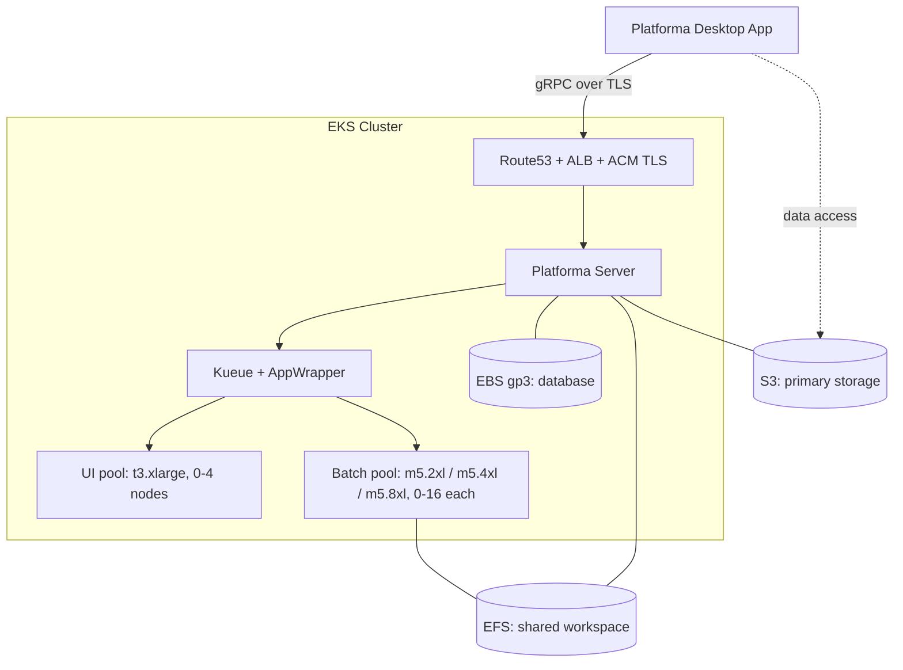
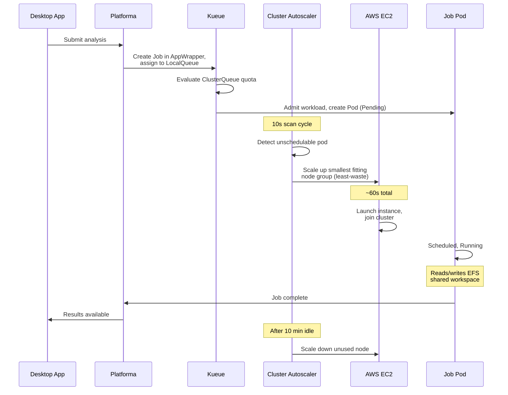

# Platforma on AWS EKS

Deploy Platforma on AWS using CloudFormation and Helm. You'll create the infrastructure through the AWS Console, install Kubernetes components from the CLI, then connect from the Platforma Desktop App.

> For manual CLI-only setup (without CloudFormation), see [Advanced installation](advanced-installation.md).

## Architecture



## What you'll do

The deployment has three phases:

**Phase 1 — AWS Console:** Deploy the CloudFormation stack. It creates the EKS cluster, node groups, EFS filesystem, S3 bucket, and all IAM roles. Takes ~15-20 minutes.

**Phase 2 — CLI:** Configure kubectl, tag node groups for autoscaler discovery, then install Kueue and Platforma via Helm. The Platforma chart includes Cluster Autoscaler, ALB Controller, and External DNS as bundled sub-charts — all enabled with flags in a single `helm install`.

**Phase 3 — Desktop App:** Download the Platforma Desktop App, connect to your cluster at `platforma.example.com`, and start running analyses.

## Prerequisites

- **AWS account** with permissions to create EKS, EFS, S3, IAM roles, ACM certificates (see [permissions.md](permissions.md))
- **Route53 hosted zone** with a registered domain (e.g. `example.com`) — the Desktop App connects only over TLS, so a domain and certificate are mandatory
- **Platforma license key**
- **CLI tools:** AWS CLI, kubectl v1.28+, Helm v3.12+
- **Platforma Desktop App** — download from [platforma.bio](https://platforma.bio) before starting

## Files in this directory

| File | Description |
|------|-------------|
| `cloudformation.yaml` | CloudFormation template (EKS + EFS + S3 + IAM) |
| `permissions.md` | AWS permissions reference for all components |
| `kueue-values.yaml` | Kueue Helm values with AppWrapper enabled |
| `values-aws-s3.yaml` | Platforma Helm values for AWS (S3 primary storage, recommended) |
| `advanced-installation.md` | Manual CLI setup guide (without CloudFormation) |
| `domain-guide.md` | How to register a domain in AWS and set up Route53 |

---

## Step 1: Deploy CloudFormation stack

Open the AWS Console and navigate to **CloudFormation → Create Stack → With new resources**.

Upload `cloudformation.yaml` or paste its S3 URL, then fill in the parameters.


### Cluster parameters

| Parameter | Default | Description |
|-----------|---------|-------------|
| Cluster name | `platforma-cluster` | EKS cluster name |
| Kubernetes version | `1.31` | EKS version |
| Platforma namespace | `platforma` | K8s namespace (created later, used in IRSA trust) |

### Networking

| Parameter | Default | Description |
|-----------|---------|-------------|
| VPC ID | *(empty = create new)* | Leave empty to create a new VPC, or provide an existing VPC ID |
| Private subnet IDs | *(empty)* | 3 private subnets (one per AZ) — required if using existing VPC |
| Public subnet IDs | *(empty)* | 3 public subnets — required for ALB when using existing VPC |
| VPC CIDR | `10.0.0.0/16` | CIDR for the new VPC (ignored with existing VPC) |

### Node groups

Default values work for most deployments. Adjust batch instance types and max counts for your workload.

| Parameter | Default | Description |
|-----------|---------|-------------|
| System instance type | `t3.large` | Platforma server, Kueue, controllers |
| System node count | `2` | Fixed count |
| UI instance type | `t3.xlarge` | Interactive tasks |
| UI max nodes | `4` | Autoscales from 0 |
| UI always-on node | `false` | Keep 1 UI node running at all times (~$200/month, eliminates cold start) |
| Batch medium | `m5.2xlarge` | 8 vCPU / 32 GiB |
| Batch large | `m5.4xlarge` | 16 vCPU / 64 GiB |
| Batch xlarge | `m5.8xlarge` | 32 vCPU / 128 GiB |
| Batch max per group | `16` | Each batch tier scales 0 to this |

**UI node cold start:** When all UI nodes are at zero, the first task waits ~2-3 minutes for a t3.xlarge to launch and join the cluster. Setting **UI always-on node** to `true` keeps one node running permanently — tasks start instantly, but adds ~$200/month to your AWS bill.

### Storage

| Parameter | Default | Description |
|-----------|---------|-------------|
| EFS performance mode | `generalPurpose` | `maxIO` for very high throughput |
| EFS throughput mode | `bursting` | `elastic` for consistent high throughput |
| S3 bucket name | *(auto-generated)* | Auto-generates as `platforma-storage-<account>-<region>` |

### DNS / TLS (required)

| Parameter | Description |
|-----------|-------------|
| **Route53 hosted zone ID** | Your hosted zone ID (e.g. `Z0123456789ABCDEF`) |
| **Domain name** | Endpoint for Platforma (e.g. `platforma.example.com`) |

These are **required**. The Desktop App connects only over TLS and requires a real domain — it cannot use IP addresses or self-signed certificates.

**What this means:** You need a domain name you own (e.g. `platforma.example.com`) and a Route53 hosted zone for it. A hosted zone is Route53's way of managing DNS records for a domain. The stack requests an ACM certificate for your domain and validates it automatically by writing a DNS record to your hosted zone — no manual certificate steps.

If you don't have a domain yet, see [How to register a domain in AWS](domain-guide.md).


### Create the stack

Click **Create Stack**. The stack takes **~15-20 minutes**.

Once complete, go to the **Outputs** tab. You'll need these values in subsequent steps.


| Output | Used in |
|--------|---------|
| `ClusterName` | Step 2 (kubeconfig), Step 3 (ASG tags) |
| `Region` | Step 2, Step 7 |
| `EfsFileSystemId` | Step 7 (EFS StorageClass) |
| `S3BucketName` | Step 7 (Platforma install) |
| `AutoscalerRoleArn` | Step 7 |
| `ALBControllerRoleArn` | Step 7 |
| `ExternalDNSRoleArn` | Step 7 |
| `PlatformaRoleArn` | Step 4 |
| `CertificateArn` | Step 7 (ingress) |

---

## Step 2: Configure kubectl

First, authenticate your AWS CLI session. If you're not sure whether you're logged in, run:

```bash
aws sts get-caller-identity
```

If this fails, log in:

```bash
# Standard credentials — run `aws configure` once to set access key + secret key
aws configure

# SSO / IAM Identity Center
aws sso login --profile <your-profile>
export AWS_PROFILE=<your-profile>
```

Then update your kubeconfig:

```bash
aws eks update-kubeconfig --name <ClusterName> --region <Region>
```

Verify:

```bash
kubectl get nodes
```

You should see 2 system nodes.

---

## Step 3: Tag node groups for autoscaler discovery

Cluster Autoscaler uses ASG tags to discover which node groups it manages. CloudFormation cannot set tag keys with dynamic values, so add them after the stack is created:

```bash
CLUSTER_NAME=<ClusterName from outputs>

for NG in $(aws eks list-nodegroups --cluster-name $CLUSTER_NAME --query 'nodegroups[]' --output text); do
  ASG=$(aws eks describe-nodegroup --cluster-name $CLUSTER_NAME --nodegroup-name $NG \
    --query 'nodegroup.resources.autoScalingGroups[0].name' --output text)
  aws autoscaling create-or-update-tags --tags \
    "ResourceId=$ASG,ResourceType=auto-scaling-group,Key=k8s.io/cluster-autoscaler/$CLUSTER_NAME,Value=owned,PropagateAtLaunch=true"
done
```

---

## Step 4: Create Platforma namespace and service account

```bash
PLATFORMA_ROLE_ARN=<PlatformaRoleArn from outputs>

kubectl create namespace platforma
kubectl create serviceaccount platforma -n platforma
kubectl annotate serviceaccount platforma -n platforma \
  eks.amazonaws.com/role-arn=$PLATFORMA_ROLE_ARN
```

---

## Step 5: Install Kueue with AppWrapper support

Kueue manages job queuing and resource allocation. AppWrapper provides single-resource status monitoring with automatic retries.

```bash
helm install kueue oci://registry.k8s.io/kueue/charts/kueue \
  --version 0.16.1 \
  -n kueue-system --create-namespace \
  -f kueue-values.yaml
```

Wait for readiness:

```bash
kubectl wait --for=condition=Available deployment/kueue-controller-manager \
  -n kueue-system --timeout=120s
```

### Install AppWrapper CRD and controller

```bash
kubectl apply --server-side -f https://github.com/project-codeflare/appwrapper/releases/download/v1.1.2/install.yaml

kubectl wait --for=condition=Available deployment/appwrapper-controller-manager \
  -n appwrapper-system --timeout=120s
```

Verify:

```bash
kubectl get pods -n kueue-system
kubectl get pods -n appwrapper-system
```

---

## Step 6: Create license secret

```bash
kubectl create secret generic platforma-license \
  -n platforma \
  --from-literal=MI_LICENSE="your-license-key"
```

---

## Step 7: Install Platforma

This installs Platforma along with the bundled sub-charts: Cluster Autoscaler, ALB Controller, External DNS, and the two StorageClasses (gp3 + EFS). Fill in all values from CloudFormation Outputs:

```bash
CLUSTER_NAME=<ClusterName from outputs>
REGION=<Region from outputs>
EFS_ID=<EfsFileSystemId from outputs>
S3_BUCKET=<S3BucketName from outputs>
CERTIFICATE_ARN=<CertificateArn from outputs>
AUTOSCALER_ROLE_ARN=<AutoscalerRoleArn from outputs>
ALB_ROLE_ARN=<ALBControllerRoleArn from outputs>
EXTERNALDNS_ROLE_ARN=<ExternalDNSRoleArn from outputs>
DOMAIN=<your domain, e.g. platforma.example.com>
DOMAIN_FILTER=<root domain of your hosted zone, e.g. example.com>

helm install platforma oci://ghcr.io/milaboratory/platforma-helm/platforma \
  --version 3.0.0 \
  -n platforma \
  -f values-aws-s3.yaml \
  \
  --set storage.main.s3.bucket=$S3_BUCKET \
  --set storage.main.s3.region=$REGION \
  --set serviceAccount.create=false \
  --set serviceAccount.name=platforma \
  \
  --set storageClasses.efs.fileSystemId=$EFS_ID \
  \
  --set cluster-autoscaler.autoDiscovery.clusterName=$CLUSTER_NAME \
  --set cluster-autoscaler.awsRegion=$REGION \
  --set "cluster-autoscaler.rbac.serviceAccount.annotations.eks\.amazonaws\.com/role-arn=$AUTOSCALER_ROLE_ARN" \
  \
  --set aws-load-balancer-controller.clusterName=$CLUSTER_NAME \
  --set "aws-load-balancer-controller.serviceAccount.annotations.eks\.amazonaws\.com/role-arn=$ALB_ROLE_ARN" \
  \
  --set external-dns.domainFilters[0]=$DOMAIN_FILTER \
  --set external-dns.txtOwnerId=$CLUSTER_NAME \
  --set "external-dns.serviceAccount.annotations.eks\.amazonaws\.com/role-arn=$EXTERNALDNS_ROLE_ARN" \
  \
  --set ingress.enabled=true \
  --set ingress.className=alb \
  --set ingress.api.host=$DOMAIN \
  --set ingress.api.tls.enabled=true \
  --set ingress.api.tls.secretName="" \
  --set ingress.api.annotations."alb\.ingress\.kubernetes\.io/scheme"=internet-facing \
  --set ingress.api.annotations."alb\.ingress\.kubernetes\.io/target-type"=ip \
  --set-json 'ingress.api.annotations.alb\.ingress\.kubernetes\.io/listen-ports=[{"HTTPS":443}]' \
  --set ingress.api.annotations."alb\.ingress\.kubernetes\.io/certificate-arn"=$CERTIFICATE_ARN \
  --set ingress.api.annotations."alb\.ingress\.kubernetes\.io/backend-protocol-version"=GRPC
```

Verify:

```bash
kubectl get pods -n platforma
kubectl get pvc -n platforma
kubectl get ingress -n platforma
kubectl get clusterqueues
kubectl get localqueues -n platforma
```

Wait for ALB provisioning and DNS propagation (1-3 minutes):

```bash
# Check ALB status
kubectl describe ingress -n platforma

# Check DNS resolution
nslookup $DOMAIN
```

---

## Step 8: Connect from Desktop App

1. **Open** the Platforma Desktop App (download from [platforma.bio](https://platforma.bio) if needed)
2. **Add** a new connection
3. **Enter** your endpoint: `platforma.example.com:443` (use your actual domain)
4. The ACM certificate secures the connection via TLS

For quick testing before DNS propagates, use port-forwarding:

```bash
kubectl port-forward svc/platforma -n platforma 6345:6345
# In Desktop App, connect to: localhost:6345
```

---

## How it works



### Scaling performance

| Operation | Duration | Notes |
|-----------|----------|-------|
| Scale-up (0 to 1 node) | ~60 seconds | Kueue admission + autoscaler detection + EC2 launch + node ready |
| Scale-down | 6-10 minutes | Configurable via cooldown settings |

---

## Verification checklist

Run after completing all steps:

```bash
echo "=== Cluster Nodes ==="
kubectl get nodes -L node.kubernetes.io/pool

echo ""
echo "=== Cluster Autoscaler ==="
kubectl get pods -n kube-system -l app.kubernetes.io/name=aws-cluster-autoscaler

echo ""
echo "=== ALB Controller ==="
kubectl get pods -n kube-system -l app.kubernetes.io/name=aws-load-balancer-controller

echo ""
echo "=== External DNS ==="
kubectl get pods -n kube-system -l app.kubernetes.io/name=external-dns

echo ""
echo "=== Kueue ==="
kubectl get pods -n kueue-system

echo ""
echo "=== AppWrapper Controller ==="
kubectl get pods -n appwrapper-system

echo ""
echo "=== Kueue Resources ==="
kubectl get resourceflavors,clusterqueues,localqueues --all-namespaces

echo ""
echo "=== Platforma ==="
kubectl get pods -n platforma
kubectl get pvc -n platforma
kubectl get ingress -n platforma
```

Expected:
- 2+ system nodes, 0 batch/UI nodes (scale on demand)
- All controller pods running
- ResourceFlavors, ClusterQueues, LocalQueues created
- Platforma pod running with PVCs bound
- Ingress with ALB address assigned

---

## Troubleshooting

### Pods stuck in Pending

```bash
# Check if Kueue admitted the workload
kubectl get workloads -A

# Check Cluster Autoscaler logs
kubectl logs -n kube-system -l app.kubernetes.io/name=aws-cluster-autoscaler --tail=50

# Check node group scaling activity
aws autoscaling describe-scaling-activities --auto-scaling-group-name <asg-name> --max-items 5
```

### PVC stuck in Pending

```bash
# Verify gp3 StorageClass exists
kubectl get sc gp3

# Verify EBS CSI driver is running
kubectl get pods -n kube-system -l app.kubernetes.io/name=aws-ebs-csi-driver
```

### EFS mount failures

```bash
# Verify mount targets exist
aws efs describe-mount-targets --file-system-id <EfsFileSystemId>

# Verify EFS CSI driver is running
kubectl get pods -n kube-system -l app.kubernetes.io/name=aws-efs-csi-driver
```

### AppWrapper not transitioning to Failed

```bash
# Check AppWrapper status
kubectl get appwrapper <name> -o yaml

# Check controller logs
kubectl logs -n appwrapper-system -l control-plane=controller-manager --tail=50
```

---

## Cleanup

> **You must uninstall all Helm releases before deleting the CloudFormation stack.** Kubernetes-created resources (ALB load balancers, DNS records, EFS mounts) block EKS cluster deletion. If you delete the stack first, these resources become orphaned and require manual cleanup.

```bash
# 1. Uninstall Helm releases (removes ALBs, DNS records, K8s resources)
# platforma includes cluster-autoscaler, aws-load-balancer-controller, external-dns as sub-charts
helm uninstall platforma -n platforma
helm uninstall kueue -n kueue-system
kubectl delete -f https://github.com/project-codeflare/appwrapper/releases/download/v1.1.2/install.yaml

# 2. Verify no load balancers remain in the VPC (blocks VPC deletion)
kubectl get svc --all-namespaces -o wide | grep LoadBalancer
kubectl get ingress --all-namespaces

# 3. Delete CloudFormation stack (removes EKS, VPC, all IAM roles)
aws cloudformation delete-stack --stack-name platforma-stack
aws cloudformation wait stack-delete-complete --stack-name platforma-stack

# 4. Delete retained resources manually (kept for data safety)
aws s3 rm s3://<S3BucketName> --recursive
aws s3 rb s3://<S3BucketName>
aws efs delete-file-system --file-system-id <EfsFileSystemId>

# 5. Delete orphaned CloudWatch log group
aws logs delete-log-group --log-group-name /aws/eks/<ClusterName>/cluster
```
