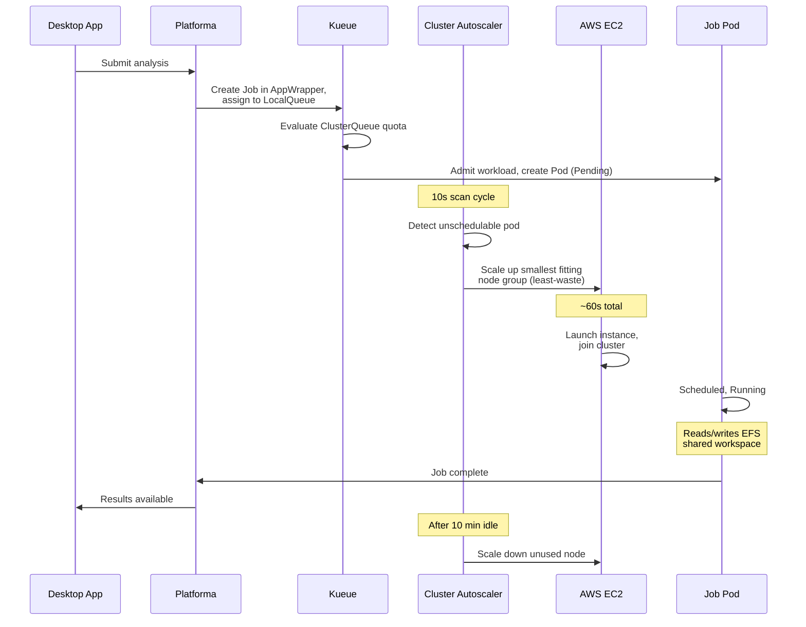

# Platforma on AWS EKS

Deploy Platforma on AWS using a single CloudFormation stack. The stack creates all infrastructure (EKS, EFS, S3, IAM) and automatically installs all Kubernetes components (Kueue, Cluster Autoscaler, ALB Controller, External DNS, Platforma) via CodeBuild.

> For manual CLI-only setup (without CloudFormation), see [Advanced installation](advanced-installation.md).

## Architecture


## What you'll do

1. **Deploy the CloudFormation stack** — fill in parameters in the AWS Console, click Create. Takes ~20 minutes.
2. **Retrieve the password** — the stack auto-generates credentials and stores them in SSM Parameter Store.
3. **Connect the Desktop App** — open the Platforma Desktop App and connect to your domain.

No CLI steps required. The stack handles everything: infrastructure, Helm installs, certificate validation, DNS records.

## Prerequisites

- **AWS account** with permissions to create EKS, EFS, S3, IAM roles, ACM certificates, CodeBuild (see [permissions.md](permissions.md))
- **Route53 hosted zone** with a registered domain (e.g. `example.com`) — the Desktop App connects only over TLS, so a domain and certificate are mandatory. If you don't have one, see [How to register a domain in AWS](domain-guide.md).
- **Platforma license key**
- **Platforma Desktop App** — download from [platforma.bio](https://platforma.bio)

## Files in this directory

| File | Description |
|------|-------------|
| `cloudformation.yaml` | CloudFormation template — creates everything |
| `permissions.md` | AWS permissions reference |
| `advanced-installation.md` | Manual CLI setup guide (without CloudFormation) |
| `domain-guide.md` | How to register a domain in AWS and set up Route53 |

---

## Step 1: Deploy CloudFormation stack

Open the AWS Console and navigate to **CloudFormation → Create Stack → With new resources**.

Upload `cloudformation.yaml` or paste its S3 URL, then fill in the parameters.


### Cluster parameters

| Parameter | Default | Description |
|-----------|---------|-------------|
| Cluster name | `platforma-cluster` | EKS cluster name |
| Kubernetes version | `1.34` | EKS version |
| Platforma namespace | `platforma` | Kubernetes namespace for Platforma |

### Networking

| Parameter | Default | Description |
|-----------|---------|-------------|
| VPC ID | *(empty = create new)* | Leave empty to create a new VPC, or provide an existing VPC ID |
| Private subnet IDs | *(leave as-is)* | 3 private subnets (one per AZ) — required if using existing VPC. The field shows `,,` by default — **do not clear it**; this is a CloudFormation workaround required when creating a new VPC. |
| Public subnet IDs | *(leave as-is)* | 3 public subnets — required for ALB when using existing VPC. Same `,,` workaround applies. |
| VPC CIDR | `10.0.0.0/16` | CIDR for the new VPC (ignored with existing VPC) |

### Workload capacity

| Parameter | Default | Description |
|-----------|---------|-------------|
| Compute family | `small` | How many jobs run simultaneously. See table below. |

| Family | Concurrent large jobs | Concurrent medium jobs | Concurrent small jobs | Recommended vCPU quota |
|--------|----------------------|----------------------|---------------------|----------------------|
| `small` | 4 | 8 | 16 | ~200 |
| `medium` | 8 | 16 | 32 | ~400 |
| `large` | 16 | 32 | 64 | ~800 |
| `xlarge` | 32 | 64 | 128 | ~1600 |

Before deploying, check that your AWS On-Demand vCPU quota meets the recommended minimum. Request an increase at [Service Quotas console](https://console.aws.amazon.com/servicequotas/home/services/ec2/quotas/L-1216C47A) if needed. The stack checks the quota during deployment and fails with an error if it is too low.

### Node groups (fixed topology, not configurable)

Instance types and node counts are not exposed as parameters. The stack creates:

| Group | Instance | Scaling | Purpose |
|-------|----------|---------|---------|
| system | m5.2xlarge | 2 fixed (1-4) | Platforma server, Kueue, controllers |
| system-large | m5.4xlarge | 0-4 | Large-dataset processing |
| ui | t3.xlarge | 0-16 | Interactive tasks |
| batch-medium | m5.2xlarge | 0-32 | 8 vCPU / 32 GiB compute |
| batch-large | m5.4xlarge | 0-32 | 16 vCPU / 64 GiB compute |
| batch-xlarge | m5.8xlarge | 0-32 | 32 vCPU / 128 GiB compute |
| batch-2xlarge | r5.4xlarge | 0-32 | 16 vCPU / 128 GiB (high memory) |
| batch-4xlarge | r5.8xlarge | 0-32 | 32 vCPU / 256 GiB (high memory) |

Cluster Autoscaler with `least-waste` expander picks the smallest group that fits each job. Batch and UI nodes scale to zero when idle (after 10 min cooldown).

### Storage

| Parameter | Default | Description |
|-----------|---------|-------------|
| EFS performance mode | `generalPurpose` | `maxIO` for very high throughput |
| S3 bucket name | *(auto-generated)* | Auto-generates as `platforma-<ClusterName>-<AccountId>` |

EFS throughput mode is hardcoded to `elastic` (pay-per-use, no burst credits to exhaust). This is not configurable.

### Platforma deployment

| Parameter | Default | Description |
|-----------|---------|-------------|
| Deploy Platforma | `false` | Set to `true` to deploy Platforma automatically after infrastructure is ready. When `false`, only infrastructure and controllers are deployed — useful for testing the stack first. |
| License key | *(empty)* | Platforma license key (`MI_LICENSE` value). Required when Deploy Platforma is `true`. |
| Platforma version | `3.0.0-rc.17` | Helm chart version from `oci://ghcr.io/milaboratory/platforma-helm/platforma` |

### Authentication

| Parameter | Default | Description |
|-----------|---------|-------------|
| Auth method | `htpasswd` | `htpasswd` for file-based auth, `ldap` for LDAP |
| Htpasswd content | *(empty)* | Pre-generated htpasswd string. When empty, a random password is auto-generated and stored in SSM Parameter Store (see Step 2). Generate manually with `htpasswd -nB username`. |

For LDAP, fill in the LDAP parameters (server URL, bind DN, search rules). See the parameter descriptions in the CloudFormation Console for details.

### Data libraries (optional)

Up to 3 external S3 data libraries can be configured. Each library needs a name and S3 bucket. Access keys are optional — when omitted, the chart creates an IRSA role for read-only access.

| Parameter | Description |
|-----------|-------------|
| Library name | Display name in the Desktop App |
| Library bucket | S3 bucket name |
| Library region | S3 region (defaults to cluster region) |
| Access key / Secret key | Leave both empty for IRSA mode, or provide both for explicit credentials |

### DNS / TLS (required)

| Parameter | Description |
|-----------|-------------|
| **Route53 hosted zone ID** | Your hosted zone ID (e.g. `Z0123456789ABCDEF`) |
| **Domain name** | Endpoint for Platforma (e.g. `platforma.example.com`) |

These are **required**. The Desktop App connects only over TLS and requires a real domain — it cannot use IP addresses or self-signed certificates.

**What this means:** You need a domain name you own (e.g. `platforma.example.com`) and a Route53 hosted zone for it. The stack requests an ACM certificate for your domain and validates it automatically by writing a DNS record to your hosted zone — no manual certificate steps.

If you don't have a domain yet, see [How to register a domain in AWS](domain-guide.md).


### Create the stack

Click **Create Stack**. The stack takes **~20 minutes**. During this time it:

1. Creates the EKS cluster, node groups, VPC (if needed), EFS, S3 bucket, IAM roles
2. Installs Kueue, AppWrapper, Cluster Autoscaler, ALB Controller, External DNS via CodeBuild
3. If `DeployPlatforma=true`: installs Platforma, creates the namespace, license secret, and auth secret

Once complete, go to the **Outputs** tab:

| Output | Description |
|--------|-------------|
| `PlatformaUrl` | URL to connect from the Desktop App |
| `UsersPasswordSSMPath` | SSM path for auto-generated password (htpasswd mode) |
| `ClusterName` | EKS cluster name (for kubectl access) |
| `Region` | AWS region |
| `HelmDeployerBuildProject` | CodeBuild logs for infra controllers |
| `PlatformaDeployerBuildProject` | CodeBuild logs for Platforma deployment |

---

## Step 2: Retrieve the password

If you left `HtpasswdContent` empty, the stack generated a random password and stored it in SSM Parameter Store. Retrieve it:

```bash
aws ssm get-parameter \
  --name /<ClusterName>/platforma/users-password \
  --with-decryption \
  --query Parameter.Value \
  --output text \
  --region <Region>
```

Replace `<ClusterName>` and `<Region>` with the values from the Outputs tab. The SSM path is also shown in the `UsersPasswordSSMPath` output.

The username is `platforma`. The password persists across stack updates — it is only generated once and reused on subsequent deploys.

---

## Step 3: Connect from Desktop App

1. **Open** the Platforma Desktop App (download from [platforma.bio](https://platforma.bio) if needed)
2. **Add** a new connection
3. **Enter** your endpoint: the URL from the `PlatformaUrl` output (e.g. `https://platforma.example.com`)
4. **Log in** with username `platforma` and the password from Step 2

ALB provisioning and DNS propagation may take 1-3 minutes after the stack completes. If the connection fails immediately after deployment, wait and retry.

---

## Accessing the cluster (optional)

To inspect the cluster directly with `kubectl`:

```bash
aws eks update-kubeconfig --name <ClusterName> --region <Region>
kubectl get nodes
kubectl get pods -n platforma
```

---

## Updating Platforma

To update the Platforma version, change the `PlatformaVersion` parameter in the CloudFormation Console and update the stack. Only the Platforma deployer CodeBuild project runs — infrastructure is not affected.

The auto-generated password is preserved across updates. It is read from SSM on each deploy, not regenerated.

---

## How it works



### Scaling performance

| Operation | Duration | Notes |
|-----------|----------|-------|
| Scale-up (0 to 1 node) | ~60 seconds | Kueue admission + autoscaler detection + EC2 launch + node ready |
| Scale-down | 6-10 minutes | Configurable via cooldown settings |

---

## Troubleshooting

### Stack stuck in CREATE_IN_PROGRESS after 20+ minutes

The most common cause is ACM certificate validation failure. The stack creates an ACM certificate and validates it by writing a DNS record to your Route53 hosted zone. This fails silently if the hosted zone ID is wrong or if the domain's NS records are not pointing at Route53.

Check certificate status in the AWS Console → Certificate Manager → your domain. If the certificate shows `PENDING_VALIDATION` after 5+ minutes, verify:
1. The **Route53 hosted zone ID** parameter matches the actual zone that controls your domain's DNS
2. Your domain's NS records are delegated to Route53 (check with `nslookup -type=NS <domain>`)

### CodeBuild deployment failed

Check the CodeBuild project logs — links are in the Outputs tab (`HelmDeployerBuildProject` and `PlatformaDeployerBuildProject`). Common causes:

- **License key missing or invalid** — `LicenseKey` parameter is required when `DeployPlatforma=true`
- **Helm chart version not found** — verify the `PlatformaVersion` parameter matches a published chart version
- **vCPU quota exceeded** — the stack checks your AWS On-Demand vCPU quota before deploying. If it's too low, request an increase at [Service Quotas console](https://console.aws.amazon.com/servicequotas/home/services/ec2/quotas/L-1216C47A)

### Pods stuck in Pending

```bash
# Check if Kueue admitted the workload
kubectl get workloads -A

# Check Cluster Autoscaler logs
kubectl logs -n platforma -l app.kubernetes.io/name=aws-cluster-autoscaler --tail=50

# Check node group scaling activity
aws autoscaling describe-scaling-activities --auto-scaling-group-name <asg-name> --max-items 5
```

### PVC stuck in Pending

```bash
# Verify gp3 StorageClass exists
kubectl get sc gp3

# Verify EBS CSI driver is running
kubectl get pods -n kube-system -l app.kubernetes.io/name=aws-ebs-csi-driver
```

### EFS mount failures

```bash
# Verify mount targets exist
aws efs describe-mount-targets --file-system-id <EfsFileSystemId>

# Verify EFS CSI driver is running
kubectl get pods -n kube-system -l app.kubernetes.io/name=aws-efs-csi-driver
```

---

## Cleanup

Delete the CloudFormation stack from the AWS Console or CLI. The stack's teardown CodeBuild project automatically:

1. Uninstalls all Helm releases (Platforma, ALB Controller, External DNS, Cluster Autoscaler, Kueue)
2. Waits for ALB deprovisioning
3. Cleans up DNS records

```bash
STACK_NAME=<your stack name>
aws cloudformation delete-stack --stack-name $STACK_NAME
aws cloudformation wait stack-delete-complete --stack-name $STACK_NAME
```

**S3 and EFS are retained** after stack deletion (data safety). Delete them manually when you are certain the data is no longer needed:

```bash
# WARNING: permanently destroys all Platforma data. There is no undo.
S3_BUCKET=<bucket name from AWS Console>
EFS_ID=<EFS filesystem ID from AWS Console>

aws s3 rm s3://$S3_BUCKET --recursive
aws s3 rb s3://$S3_BUCKET
aws efs delete-file-system --file-system-id $EFS_ID
```

CloudWatch log groups are also retained:

```bash
CLUSTER_NAME=<cluster name>
aws logs delete-log-group --log-group-name /aws/eks/$CLUSTER_NAME/cluster 2>/dev/null || true
aws logs delete-log-group --log-group-name /aws/codebuild/${CLUSTER_NAME}-helm-deployer 2>/dev/null || true
aws logs delete-log-group --log-group-name /aws/codebuild/${CLUSTER_NAME}-platforma-deployer 2>/dev/null || true
```
