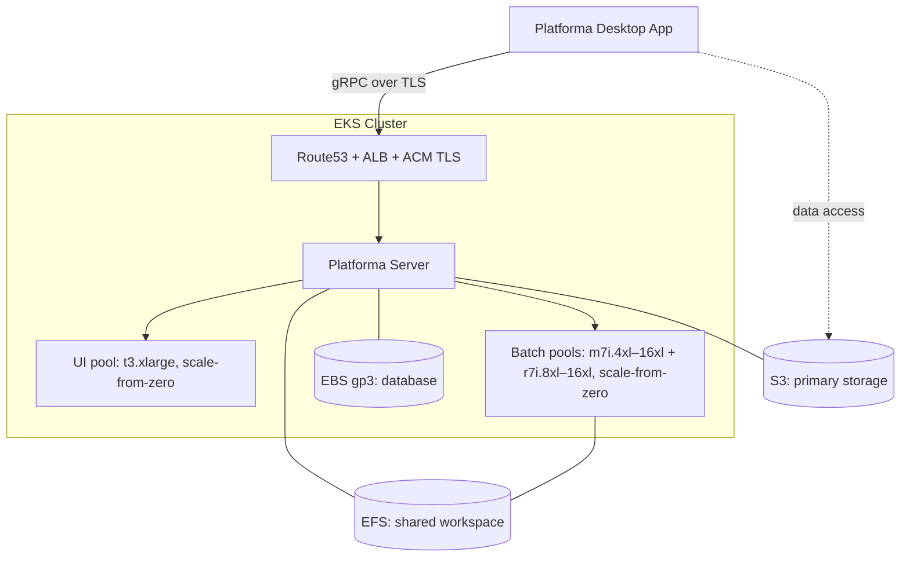
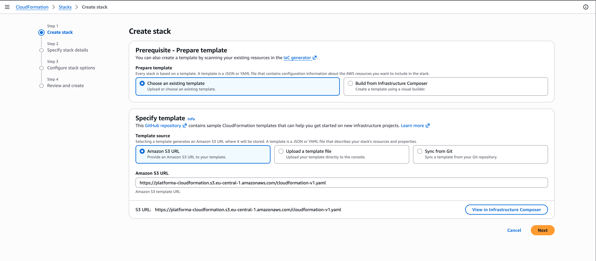
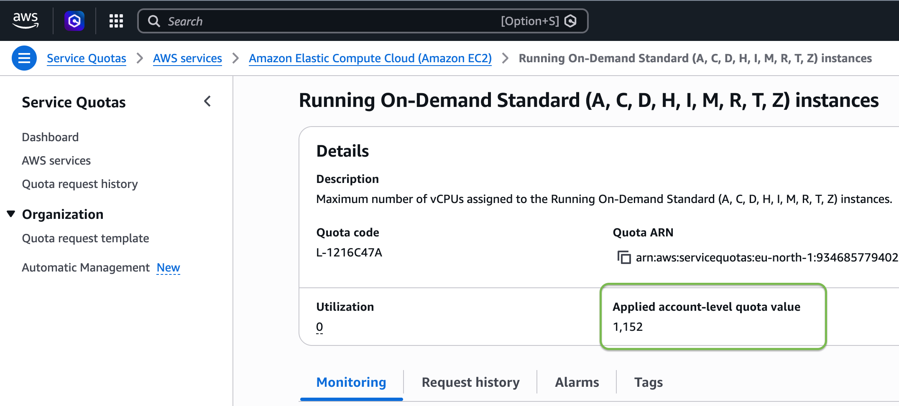
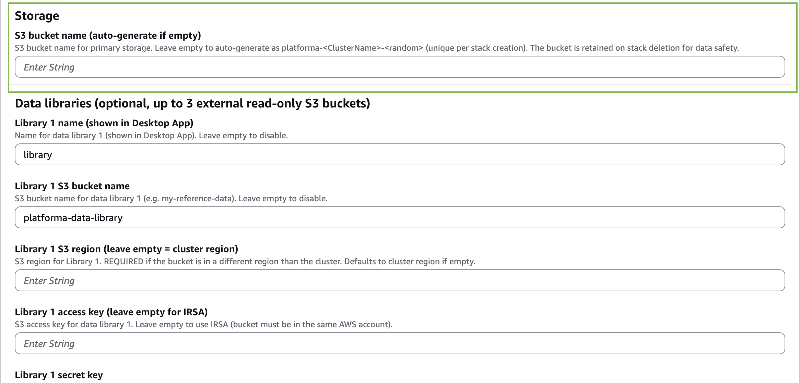

# Platforma on AWS EKS

A single CloudFormation stack creates all infrastructure (EKS, EFS, S3, IAM) and installs all Kubernetes components (Kueue, Cluster Autoscaler, ALB Controller, External DNS, Platforma) via CodeBuild.

> For manual CLI setup, see [Advanced installation](advanced-installation.md).

### Architecture

### What you'll do

1. **Deploy the CloudFormation stack** — fill in parameters in the AWS Console, click Create. Takes ~20 minutes.
2. **Retrieve the password** — the stack auto-generates credentials and stores them in SSM Parameter Store.
3. **Connect the Desktop App** — open the Platforma Desktop App and connect to your domain.

Everything runs in the AWS Console. The stack handles infrastructure, Helm installs, certificate validation, and DNS
records.

## Prerequisites

- **AWS account** — a new account has all required permissions. For sub-accounts, add permissions to create EKS, EFS, S3,
  IAM roles, ACM certificates, and CodeBuild (see [permissions.md](permissions.md) for exact values).
- **Route53 hosted zone** with a registered domain (e.g. `example.com`) — the Desktop App requires TLS, so you need a
  domain and certificate. If you don't have one, see [How to register a domain in AWS](domain-guide.md).
- **S3 Data Libraries** — external S3 buckets with your sample data. You need at least the bucket name. If the bucket belongs to a different AWS account, also provide `AccessKey` and `SecretKey`.
- **Platforma license key** — request one at [platforma.bio/getlicense](https://platforma.bio/getlicense) or
  email [licensing@milaboratories.com](mailto:licensing@milaboratories.com).
- **Platforma Desktop App** — download from [https://platforma.bio/downloads](https://platforma.bio/downloads)

## 1. Deploy CloudFormation stack

### Step 1. Create stack

Open the AWS Console and navigate to **CloudFormation → Create Stack → With new resources (standard)**.

- **Prerequisite - Prepare template** - Choose an existing template
- **Specify template** - Amazon S3 URL
    - Paste the URL in "Amazon S3 URL" field:
      `https://platforma-cloudformation.s3.eu-central-1.amazonaws.com/cloudformation-eks-1-35.yaml`
- Press "Next"

### Step 2. Specify stack details

Enter a **stack name** (e.g. `platforma-prod`). This identifies the stack in the AWS Console.

### Cluster

| Parameter           | Default             | Description                        |
|---------------------|---------------------|------------------------------------|
| Cluster name        | `platforma-cluster` | EKS cluster name                   |
| Platforma namespace | `platforma`         | Kubernetes namespace for Platforma |

### Networking

| Parameter          | Default                | Description                                                                                                                                                                                 |
|--------------------|------------------------|---------------------------------------------------------------------------------------------------------------------------------------------------------------------------------------------|
| VPC ID             | *(empty = create new)* | Leave empty to create a new VPC, or provide an existing VPC ID                                                                                                                              |
| Private subnet IDs | *(leave as-is)*        | 3 private subnets (one per AZ) — required when using an existing VPC. The field shows `,,` by default — **do not clear it**; CloudFormation needs this placeholder when creating a new VPC. |
| Public subnet IDs  | *(leave as-is)*        | 3 public subnets — required for ALB when using an existing VPC. Same `,,` placeholder applies.                                                                                              |
| VPC CIDR           | `10.0.0.0/16`          | CIDR for the new VPC (ignored with existing VPC)                                                                                                                                            |

### DNS / TLS (required)

| Parameter                  | Description                                               |
|----------------------------|-----------------------------------------------------------|
| **Route53 hosted zone ID** | **Your hosted zone ID (e.g. `Z0123456789ABCDEF`)**        |
| **Domain name**            | **Endpoint for Platforma (e.g. `platforma.example.com`)** |

Both fields are **required**. The Desktop App requires TLS with a valid certificate — IP addresses and self-signed
certificates do not work.

You need a domain you own (e.g. `platforma.example.com`) and a Route53 hosted zone for it. The stack requests an ACM
certificate and validates it automatically by writing a DNS record to your hosted zone.

If you don't have a domain yet, see [How to register a domain in AWS](domain-guide.md).

### Platforma

| Parameter              | Default               | Description                                                                                                                                                      |
|------------------------|-----------------------|------------------------------------------------------------------------------------------------------------------------------------------------------------------|
| Deploy Platforma       | `true`                | Set to `true` to deploy Platforma after infrastructure is ready. When `false`, the stack deploys only infrastructure and controllers — useful for testing first. |
| **License key**        | **(required)**        | **Platforma license key.**                                                                                                                                       |
| Platforma version      | *(empty)*             | Leave empty to use the version built into the template. On stack update with a new template, an empty value automatically picks up the new version. Set explicitly to pin a specific version. |
| Custom container image | *(empty)*             | Override the default Platforma container image. Leave empty to use the chart default.                                                                            |

### Authentication

| Parameter        | Default    | Description                                                                                                                                                                         |
|------------------|------------|-------------------------------------------------------------------------------------------------------------------------------------------------------------------------------------|
| Auth method      | `htpasswd` | `htpasswd` for file-based auth, `ldap` for LDAP                                                                                                                                     |
| Htpasswd content | *(empty)*  | Pre-generated htpasswd string. When empty, the stack generates a random password and stores it in SSM Parameter Store (see Step 2). Generate manually with `htpasswd -nB username`. |

For LDAP, fill in the LDAP parameters (server URL, bind DN, search rules). See the parameter descriptions in the
CloudFormation Console for details.

### Cluster sizing

1. Open [Service Quotas console](https://console.aws.amazon.com/servicequotas/home/services/ec2/quotas/L-1216C47A)
2. Find "Applied account-level quota value" (see the screenshot). This is the maximum number of vCPUs your account can launch.
   
3. In **Deployment size (controls parallelism)** select the maximum available size from the table below. Request an increase if
   needed. The stack checks the quota during deployment and fails with an error if it is too low.

| Size     | Recommended vCPU quota | Max single-job    | Approximate parallelism (samples in parallel) |
|----------|------------------------|-------------------|--------------------------------------------------|
| `small`  | ~400                   | 62 vCPU / 500 GiB | ~4 large or ~16 small jobs                       |
| `medium` | ~700                   | 62 vCPU / 500 GiB | ~8 large or ~32 small jobs                       |
| `large`  | ~1400                  | 62 vCPU / 500 GiB | ~16 large or ~64 small jobs                      |
| `xlarge` | ~2700                  | 62 vCPU / 500 GiB | ~32 large or ~128 small jobs                     |

| Parameter       | Default | Description                                                                                                              |
|-----------------|---------|--------------------------------------------------------------------------------------------------------------------------|
| Deployment size | `small` | Controls node group scaling limits and Kueue quotas. All sizes support the same max single-job size (62 vCPU / 500 GiB). |

### Storage

| Parameter            | Default            | Description                                             |
|----------------------|--------------------|---------------------------------------------------------|
| S3 bucket name       | *(auto-generated)* | Auto-generates as `platforma-<ClusterName>-<random>`. Each stack gets a unique name, so retries never collide with retained buckets. |

### Data libraries

Configure up to 3 external S3 buckets containing your sample data. Each library needs a name and a bucket. Access keys are
optional — when omitted, the stack creates an IAM role for read-only access to the bucket.

| Parameter               | Description                                                              |
|-------------------------|--------------------------------------------------------------------------|
| Library name            | Display name in the Desktop App                                          |
| Library bucket          | S3 bucket name                                                           |
| Library region          | S3 region — required if bucket is in a different region than the cluster |
| Access key / Secret key | Leave both empty for IAM-role-based access, or provide both for explicit credentials |

### Step 3. Create the stack

- At the bottom of the page, check "I acknowledge that...". 
- Press "Next"

### Step 4. Review and create

**Re-check minimal required parameters:**
- Stack name: just a name of your stack
- AuthMethod: htpasswd or LDAP
- DataLibrary[N] parameters: your samples libraries configuration 
- DomainName & HostedZoneId: domain to make Platforma available
- LicenseKey: check not empty

Scroll down and press "Submit". The stack takes **~20 minutes**. 

During this time it:

1. Creates the EKS cluster, node groups, VPC (if needed), EFS, S3 bucket, IAM roles
2. Installs Kueue, AppWrapper, Cluster Autoscaler, ALB Controller, External DNS via CodeBuild
3. If `DeployPlatforma=true` (default): installs Platforma, creates the namespace, license secret, and auth secret

## 2. After installation
Go to the **Outputs** tab and note the values below. You will need them in the next steps:

| Output | Description |
|--------|-------------|
| `PlatformaUrl` | URL to connect from the Desktop App |
| `DefaultUsername` | Login username (htpasswd mode) |
| `UsersPasswordSSMPath` | SSM path for auto-generated password (htpasswd mode) |
| `UsersPasswordSSMConsole` | Direct link to the SSM parameter in the AWS Console |
| `S3BucketOutput` | S3 bucket name (retained on stack deletion — note this for cleanup) |
| `ClusterName` | EKS cluster name (for kubectl access) |
| `Region` | AWS region |
| `HelmDeployerBuildProject` | CodeBuild logs for infra controllers |
| `PlatformaDeployerBuildProject` | CodeBuild logs for Platforma deployment |

---

### Retrieve the password

If you left `HtpasswdContent` empty, the stack generated a random password and stored it in SSM Parameter Store.

Open the `UsersPasswordSSMConsole` link from the Outputs tab (or navigate to **Systems Manager → Parameter Store** in your
region). Find the parameter shown in `UsersPasswordSSMPath`, click **Show** to reveal the value.

The username is `platforma`. The stack generates the password once and reuses it on subsequent deploys.

---

## 3. Connect from Desktop App

1. **Open** the Platforma Desktop App (download from [platforma.bio](https://platforma.bio) if needed)
2. **Add** a new connection
3. **Enter** the `PlatformaUrl` from the Outputs tab (e.g. `https://platforma.example.com`)
4. **Log in** with username `platforma` and the password from Step 2

ALB provisioning and DNS propagation take 1-3 minutes after the stack completes. If the connection fails right away,
wait and retry.

---

## Updating Platforma

To update Platforma, replace the CloudFormation template URL with the new version and update the stack:

1. Go to **CloudFormation → Stacks → select your stack → Update → Replace current template**
2. Paste the new template S3 URL
3. Click through the parameters — if `PlatformaVersion` is empty (the default), the new template's built-in
   version is used automatically. No need to type anything.
4. To pin a specific version instead, enter it explicitly in the `PlatformaVersion` field.

Only the Platforma deployer CodeBuild project runs — infrastructure stays unchanged.
The auto-generated password persists across updates. The deployer reads it from SSM on each deploy.

---

## Troubleshooting

### Stack stuck in CREATE_IN_PROGRESS after 20+ minutes

The most common cause is ACM certificate validation failure. The stack creates an ACM certificate and validates it by
writing a DNS record to your Route53 hosted zone. This fails silently if the hosted zone ID is wrong or the domain's NS
records point elsewhere.

Check certificate status in the AWS Console → **Certificate Manager** → your domain. If the certificate shows
`PENDING_VALIDATION` after 5+ minutes, verify:

1. The **Route53 hosted zone ID** parameter matches the actual zone that controls your domain's DNS
2. Your domain's NS records are delegated to Route53

### CodeBuild deployment failed

Check the CodeBuild project logs — links are in the Outputs tab (`HelmDeployerBuildProject` and
`PlatformaDeployerBuildProject`). Common causes:

- **License key missing or invalid** — `LicenseKey` parameter is required when `DeployPlatforma=true`
- **Helm chart version not found** — verify the `PlatformaVersion` parameter matches a published chart version
- **vCPU quota exceeded** — the stack checks your AWS On-Demand vCPU quota before deploying. If it's too low, request an
  increase at [Service Quotas console](https://console.aws.amazon.com/servicequotas/home/services/ec2/quotas/L-1216C47A)

---

## Cleanup

Delete the CloudFormation stack: **CloudFormation → Stacks → select your stack → Delete**. The stack uninstalls all Helm
releases, waits for ALB deprovisioning, and cleans up DNS records before deleting infrastructure.

**S3 and EFS persist** after stack deletion to protect data. Delete them manually when you no longer need the data:

1. **S3 bucket** — go to **S3** in the Console, find the bucket (name from `S3BucketOutput` in the Outputs tab), empty it, then delete it
2. **EFS filesystem** — go to **EFS** in the Console, find the filesystem (tagged with the cluster name), delete it
