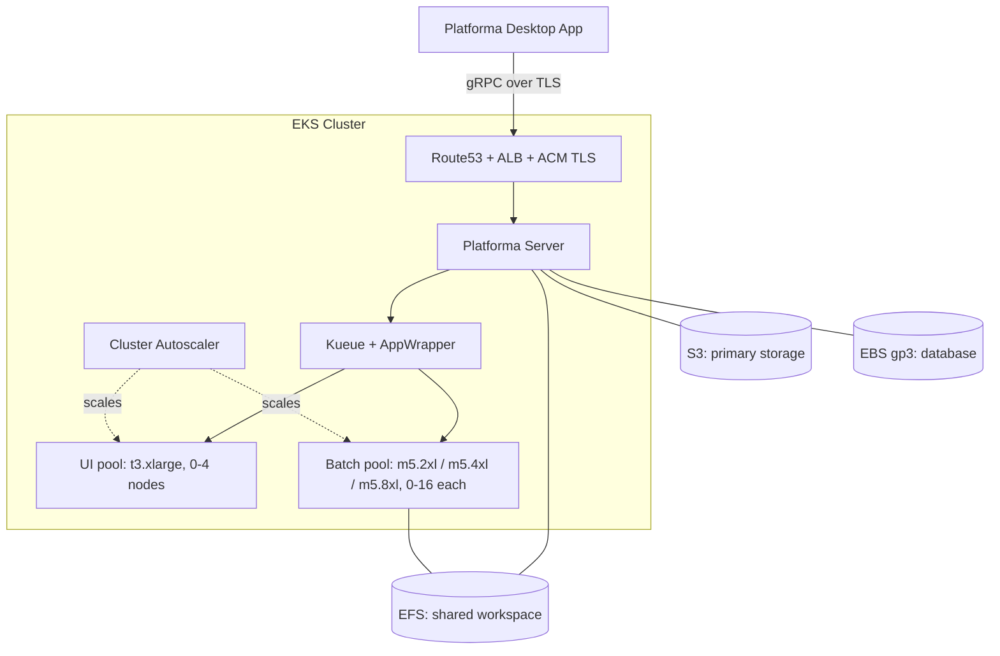
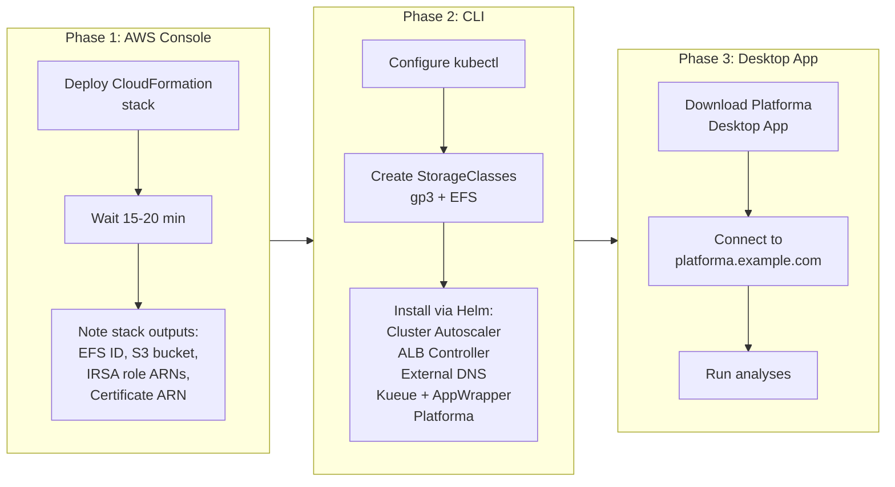
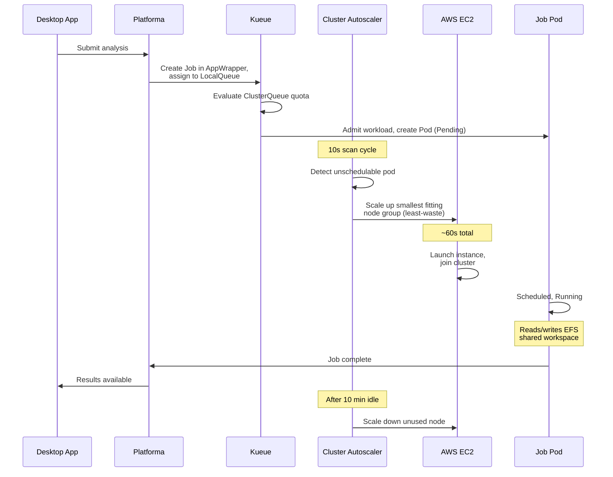

# Platforma on AWS EKS

Deploy Platforma on AWS using CloudFormation and Helm. You'll create the infrastructure through the AWS Console, install Kubernetes components from the CLI, then connect from the Platforma Desktop App.

> For manual CLI-only setup (without CloudFormation), see [Advanced installation](advanced-installation.md).

## Architecture



## What you'll do

The deployment has three phases:



1. **AWS Console** — deploy the CloudFormation stack, which creates the EKS cluster, node groups, EFS, S3 bucket, and all IAM roles (~15-20 min)
2. **CLI** — install Kubernetes components that CloudFormation cannot manage: StorageClasses, Cluster Autoscaler, ALB Controller, External DNS, Kueue, and Platforma itself
3. **Desktop App** — download the Platforma Desktop App, connect to your cluster, and start running analyses

## Prerequisites

- **AWS account** with permissions to create EKS, EFS, S3, IAM roles, ACM certificates (see [permissions.md](permissions.md))
- **Route53 hosted zone** with a registered domain (e.g. `example.com`) — the Desktop App connects only over TLS, so a domain and certificate are mandatory
- **Platforma license key**
- **CLI tools:** AWS CLI, kubectl v1.28+, Helm v3.12+
- **Platforma Desktop App** — download from [platforma.bio](https://platforma.bio) before starting

## Files in this directory

| File | Description |
|------|-------------|
| `cloudformation.yaml` | CloudFormation template (EKS + EFS + S3 + IAM) |
| `permissions.md` | AWS permissions reference for all components |
| `kueue-values.yaml` | Kueue Helm values with AppWrapper enabled |
| `values-aws-s3.yaml` | Platforma Helm values for AWS (S3 primary storage, recommended) |
| `advanced-installation.md` | Manual CLI setup guide (without CloudFormation) |

---

## Step 1: Deploy CloudFormation stack

Open the AWS Console and navigate to **CloudFormation → Create Stack → With new resources**.

Upload `cloudformation.yaml` or paste its S3 URL, then fill in the parameters.


### Cluster parameters

| Parameter | Default | Description |
|-----------|---------|-------------|
| Cluster name | `platforma-cluster` | EKS cluster name |
| Kubernetes version | `1.31` | EKS version |
| Platforma namespace | `platforma` | K8s namespace (created later, used in IRSA trust) |

### Networking

| Parameter | Default | Description |
|-----------|---------|-------------|
| VPC ID | *(empty = create new)* | Leave empty to create a new VPC, or provide an existing VPC ID |
| Private subnet IDs | *(empty)* | 3 private subnets (one per AZ) — required if using existing VPC |
| Public subnet IDs | *(empty)* | 3 public subnets — required for ALB when using existing VPC |
| VPC CIDR | `10.0.0.0/16` | CIDR for the new VPC (ignored with existing VPC) |

### Node groups

Default values work for most deployments. Adjust batch instance types and max counts for your workload.

| Parameter | Default | Description |
|-----------|---------|-------------|
| System instance type | `t3.large` | Platforma server, Kueue, controllers |
| System node count | `2` | Fixed count |
| UI instance type | `t3.xlarge` | Interactive tasks |
| UI max nodes | `4` | Autoscales from 0 |
| Batch medium | `m5.2xlarge` | 8 vCPU / 32 GiB |
| Batch large | `m5.4xlarge` | 16 vCPU / 64 GiB |
| Batch xlarge | `m5.8xlarge` | 32 vCPU / 128 GiB |
| Batch max per group | `16` | Each batch tier scales 0 to this |

### Storage

| Parameter | Default | Description |
|-----------|---------|-------------|
| EFS performance mode | `generalPurpose` | `maxIO` for very high throughput |
| EFS throughput mode | `bursting` | `elastic` for consistent high throughput |
| S3 bucket name | *(auto-generated)* | Auto-generates as `platforma-storage-<account>-<region>` |

### DNS / TLS (required)

| Parameter | Description |
|-----------|-------------|
| **Route53 hosted zone ID** | Your hosted zone ID (e.g. `Z0123456789ABCDEF`) |
| **Domain name** | Endpoint for Platforma (e.g. `platforma.example.com`) |

These are **required**. The stack creates an ACM certificate with automatic DNS validation via Route53. The Desktop App requires TLS — it connects only with a valid domain and certificate.


### Create the stack

Click **Create Stack**. The stack takes **~15-20 minutes**.

Once complete, go to the **Outputs** tab. You'll need these values in subsequent steps.


| Output | Used in |
|--------|---------|
| `ClusterName` | Step 2 (kubeconfig) |
| `Region` | Step 2, Step 10 |
| `EfsFileSystemId` | Step 3 (EFS StorageClass) |
| `S3BucketName` | Step 10 (Platforma install) |
| `AutoscalerRoleArn` | Step 4 |
| `ALBControllerRoleArn` | Step 5 |
| `ExternalDNSRoleArn` | Step 6 |
| `PlatformaRoleArn` | Step 7 |
| `CertificateArn` | Step 10 (ingress) |

---

## Step 2: Configure kubectl

```bash
aws eks update-kubeconfig --name <ClusterName> --region <Region>
```

Verify:

```bash
kubectl get nodes
```

You should see 2 system nodes.

---

## Step 3: Create StorageClasses

CloudFormation manages only AWS resources. Create the two required StorageClasses manually.

### gp3 (EBS block storage for database)

```bash
kubectl apply -f - <<'EOF'
apiVersion: storage.k8s.io/v1
kind: StorageClass
metadata:
  name: gp3
provisioner: ebs.csi.aws.com
parameters:
  type: gp3
volumeBindingMode: WaitForFirstConsumer
reclaimPolicy: Delete
allowVolumeExpansion: true
EOF
```

### EFS (shared workspace for jobs)

Replace `<EfsFileSystemId>` with the value from CloudFormation Outputs:

```bash
kubectl apply -f - <<EOF
apiVersion: storage.k8s.io/v1
kind: StorageClass
metadata:
  name: efs-platforma
provisioner: efs.csi.aws.com
parameters:
  provisioningMode: efs-ap
  fileSystemId: <EfsFileSystemId>
  directoryPerms: "755"
  uid: "1010"
  gid: "1010"
  basePath: "/dynamic"
EOF
```

The `uid`/`gid` enforce UID 1010 / GID 1010 on EFS Access Points, matching Platforma's non-root container user.

---

## Step 4: Install Cluster Autoscaler

Cluster Autoscaler adds nodes when pending pods need capacity. Required for batch and UI node groups that start at 0 nodes.

Create the service account and annotate it with the IRSA role from CloudFormation:

```bash
AUTOSCALER_ROLE_ARN=<AutoscalerRoleArn from outputs>
CLUSTER_NAME=<ClusterName from outputs>

kubectl create serviceaccount cluster-autoscaler -n kube-system
kubectl annotate serviceaccount cluster-autoscaler \
  -n kube-system \
  eks.amazonaws.com/role-arn=$AUTOSCALER_ROLE_ARN

# Tag ASGs for autoscaler discovery (CloudFormation cannot set dynamic tag keys)
for NG in $(aws eks list-nodegroups --cluster-name $CLUSTER_NAME --query 'nodegroups[]' --output text); do
  ASG=$(aws eks describe-nodegroup --cluster-name $CLUSTER_NAME --nodegroup-name $NG \
    --query 'nodegroup.resources.autoScalingGroups[0].name' --output text)
  aws autoscaling create-or-update-tags --tags \
    "ResourceId=$ASG,ResourceType=auto-scaling-group,Key=k8s.io/cluster-autoscaler/$CLUSTER_NAME,Value=owned,PropagateAtLaunch=true"
done
```

Install via Helm:

```bash
helm repo add autoscaler https://kubernetes.github.io/autoscaler
helm repo update

helm install cluster-autoscaler autoscaler/cluster-autoscaler \
  --namespace kube-system \
  --set autoDiscovery.clusterName=$CLUSTER_NAME \
  --set awsRegion=<Region> \
  --set rbac.serviceAccount.create=false \
  --set rbac.serviceAccount.name=cluster-autoscaler \
  --set extraArgs.scale-down-delay-after-add=10m \
  --set extraArgs.scale-down-unneeded-time=10m \
  --set extraArgs.scale-down-utilization-threshold=0.5 \
  --set extraArgs.expander=least-waste
```

Verify:

```bash
kubectl get pods -n kube-system -l app.kubernetes.io/name=aws-cluster-autoscaler
```

---

## Step 5: Install AWS Load Balancer Controller

The ALB Controller creates Application Load Balancers from Kubernetes Ingress resources.

```bash
ALB_ROLE_ARN=<ALBControllerRoleArn from outputs>

kubectl create serviceaccount aws-load-balancer-controller -n kube-system
kubectl annotate serviceaccount aws-load-balancer-controller \
  -n kube-system \
  eks.amazonaws.com/role-arn=$ALB_ROLE_ARN
```

Install via Helm:

```bash
helm repo add eks https://aws.github.io/eks-charts
helm repo update

helm install aws-load-balancer-controller eks/aws-load-balancer-controller \
  -n kube-system \
  --set clusterName=$CLUSTER_NAME \
  --set serviceAccount.create=false \
  --set serviceAccount.name=aws-load-balancer-controller
```

Verify:

```bash
kubectl get pods -n kube-system -l app.kubernetes.io/name=aws-load-balancer-controller
```

---

## Step 6: Install External DNS

External DNS manages Route53 records from Kubernetes Ingress annotations.

```bash
EXTERNALDNS_ROLE_ARN=<ExternalDNSRoleArn from outputs>

kubectl create serviceaccount external-dns -n kube-system
kubectl annotate serviceaccount external-dns \
  -n kube-system \
  eks.amazonaws.com/role-arn=$EXTERNALDNS_ROLE_ARN
```

Install via Helm. Set `DOMAIN_FILTER` to the root domain of your hosted zone (e.g. `example.com`):

```bash
DOMAIN_FILTER=<your root domain, e.g. example.com>

helm repo add external-dns https://kubernetes-sigs.github.io/external-dns/
helm repo update

helm install external-dns external-dns/external-dns \
  -n kube-system \
  --set serviceAccount.create=false \
  --set serviceAccount.name=external-dns \
  --set domainFilters[0]=$DOMAIN_FILTER \
  --set policy=upsert-only \
  --set registry=txt \
  --set txtOwnerId=$CLUSTER_NAME
```

Verify:

```bash
kubectl get pods -n kube-system -l app.kubernetes.io/name=external-dns
```

---

## Step 7: Create Platforma namespace and service account

```bash
PLATFORMA_ROLE_ARN=<PlatformaRoleArn from outputs>

kubectl create namespace platforma
kubectl create serviceaccount platforma -n platforma
kubectl annotate serviceaccount platforma -n platforma \
  eks.amazonaws.com/role-arn=$PLATFORMA_ROLE_ARN
```

---

## Step 8: Install Kueue with AppWrapper support

Kueue manages job queuing and resource allocation. AppWrapper provides single-resource status monitoring with automatic retries.

```bash
helm install kueue oci://registry.k8s.io/kueue/charts/kueue \
  --version 0.16.1 \
  -n kueue-system --create-namespace \
  -f kueue-values.yaml
```

Wait for readiness:

```bash
kubectl wait --for=condition=Available deployment/kueue-controller-manager \
  -n kueue-system --timeout=120s
```

### Install AppWrapper CRD and controller

```bash
kubectl apply --server-side -f https://github.com/project-codeflare/appwrapper/releases/download/v1.1.2/install.yaml

kubectl wait --for=condition=Available deployment/appwrapper-controller-manager \
  -n appwrapper-system --timeout=120s
```

Verify:

```bash
kubectl get pods -n kueue-system
kubectl get pods -n appwrapper-system
```

---

## Step 9: Create license secret

```bash
kubectl create secret generic platforma-license \
  -n platforma \
  --from-literal=MI_LICENSE="your-license-key"
```

---

## Step 10: Install Platforma

Use values from CloudFormation Outputs:

```bash
CERTIFICATE_ARN=<CertificateArn from outputs>
S3_BUCKET=<S3BucketName from outputs>
REGION=<Region from outputs>
DOMAIN=<your domain, e.g. platforma.example.com>

helm install platforma oci://ghcr.io/milaboratory/platforma-helm/platforma \
  --version 3.0.0 \
  -n platforma \
  -f values-aws-s3.yaml \
  --set storage.main.s3.bucket=$S3_BUCKET \
  --set storage.main.s3.region=$REGION \
  --set serviceAccount.create=false \
  --set serviceAccount.name=platforma \
  --set ingress.enabled=true \
  --set ingress.className=alb \
  --set ingress.api.host=$DOMAIN \
  --set ingress.api.tls.enabled=true \
  --set ingress.api.tls.secretName="" \
  --set ingress.api.annotations."alb\.ingress\.kubernetes\.io/scheme"=internet-facing \
  --set ingress.api.annotations."alb\.ingress\.kubernetes\.io/target-type"=ip \
  --set-json 'ingress.api.annotations.alb\.ingress\.kubernetes\.io/listen-ports=[{"HTTPS":443}]' \
  --set ingress.api.annotations."alb\.ingress\.kubernetes\.io/certificate-arn"=$CERTIFICATE_ARN \
  --set ingress.api.annotations."alb\.ingress\.kubernetes\.io/backend-protocol-version"=GRPC
```

Verify:

```bash
kubectl get pods -n platforma
kubectl get pvc -n platforma
kubectl get ingress -n platforma
kubectl get clusterqueues
kubectl get localqueues -n platforma
```

Wait for ALB provisioning and DNS propagation (1-3 minutes):

```bash
# Check ALB status
kubectl describe ingress -n platforma

# Check DNS resolution
nslookup $DOMAIN
```

---

## Step 11: Connect from Desktop App

1. **Open** the Platforma Desktop App (download from [platforma.bio](https://platforma.bio) if needed)
2. **Add** a new connection
3. **Enter** your endpoint: `platforma.example.com:443` (use your actual domain)
4. The ACM certificate secures the connection via TLS

For quick testing before DNS propagates, use port-forwarding:

```bash
kubectl port-forward svc/platforma -n platforma 6345:6345
# In Desktop App, connect to: localhost:6345
```

---

## How it works



### Scaling performance

| Operation | Duration | Notes |
|-----------|----------|-------|
| Scale-up (0 to 1 node) | ~60 seconds | Kueue admission + autoscaler detection + EC2 launch + node ready |
| Scale-down | 6-10 minutes | Configurable via cooldown settings |

---

## Verification checklist

Run after completing all steps:

```bash
echo "=== Cluster Nodes ==="
kubectl get nodes -L node.kubernetes.io/pool

echo ""
echo "=== Cluster Autoscaler ==="
kubectl get pods -n kube-system -l app.kubernetes.io/name=aws-cluster-autoscaler

echo ""
echo "=== ALB Controller ==="
kubectl get pods -n kube-system -l app.kubernetes.io/name=aws-load-balancer-controller

echo ""
echo "=== External DNS ==="
kubectl get pods -n kube-system -l app.kubernetes.io/name=external-dns

echo ""
echo "=== Kueue ==="
kubectl get pods -n kueue-system

echo ""
echo "=== AppWrapper Controller ==="
kubectl get pods -n appwrapper-system

echo ""
echo "=== Kueue Resources ==="
kubectl get resourceflavors,clusterqueues,localqueues --all-namespaces

echo ""
echo "=== Platforma ==="
kubectl get pods -n platforma
kubectl get pvc -n platforma
kubectl get ingress -n platforma
```

Expected:
- 2+ system nodes, 0 batch/UI nodes (scale on demand)
- All controller pods running
- ResourceFlavors, ClusterQueues, LocalQueues created
- Platforma pod running with PVCs bound
- Ingress with ALB address assigned

---

## Troubleshooting

### Pods stuck in Pending

```bash
# Check if Kueue admitted the workload
kubectl get workloads -A

# Check Cluster Autoscaler logs
kubectl logs -n kube-system -l app.kubernetes.io/name=aws-cluster-autoscaler --tail=50

# Check node group scaling activity
aws autoscaling describe-scaling-activities --auto-scaling-group-name <asg-name> --max-items 5
```

### PVC stuck in Pending

```bash
# Verify gp3 StorageClass exists
kubectl get sc gp3

# Verify EBS CSI driver is running
kubectl get pods -n kube-system -l app.kubernetes.io/name=aws-ebs-csi-driver
```

### EFS mount failures

```bash
# Verify mount targets exist
aws efs describe-mount-targets --file-system-id <EfsFileSystemId>

# Verify EFS CSI driver is running
kubectl get pods -n kube-system -l app.kubernetes.io/name=aws-efs-csi-driver
```

### AppWrapper not transitioning to Failed

```bash
# Check AppWrapper status
kubectl get appwrapper <name> -o yaml

# Check controller logs
kubectl logs -n appwrapper-system -l control-plane=controller-manager --tail=50
```

---

## Cleanup

```bash
# Delete Helm releases first
helm uninstall platforma -n platforma
helm uninstall external-dns -n kube-system
helm uninstall aws-load-balancer-controller -n kube-system
helm uninstall kueue -n kueue-system
helm uninstall cluster-autoscaler -n kube-system
kubectl delete -f https://github.com/project-codeflare/appwrapper/releases/download/v1.1.2/install.yaml

# Empty S3 bucket (required before stack deletion)
# If your IAM user/role is blocked by the bucket policy, delete the policy first:
#   aws s3api delete-bucket-policy --bucket <S3BucketName>
aws s3 rm s3://<S3BucketName> --recursive

# Delete CloudFormation stack (removes EKS, EFS, all IAM roles)
# Note: S3 bucket has DeletionPolicy: Retain — delete manually after stack removal:
#   aws s3 rb s3://<S3BucketName> --force
aws cloudformation delete-stack --stack-name platforma-stack
aws cloudformation wait stack-delete-complete --stack-name platforma-stack
```
