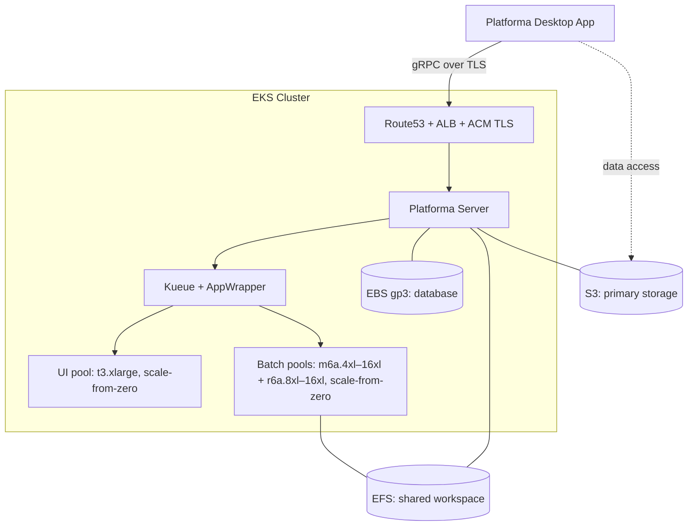
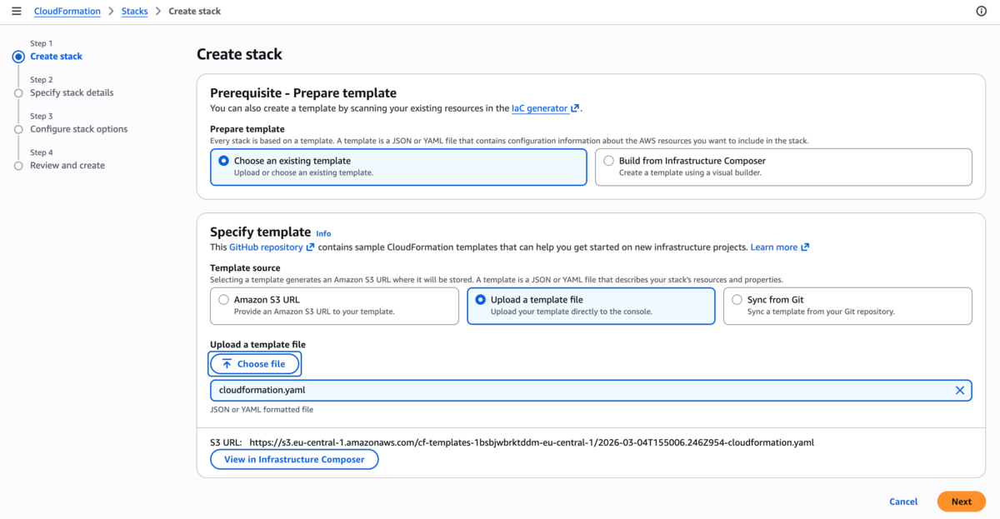
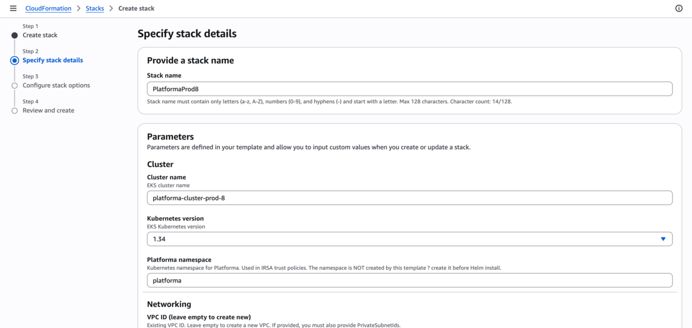
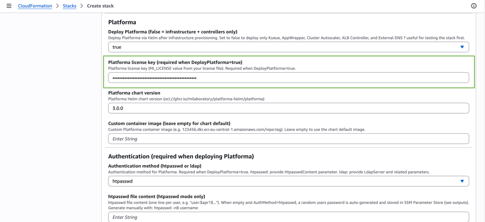
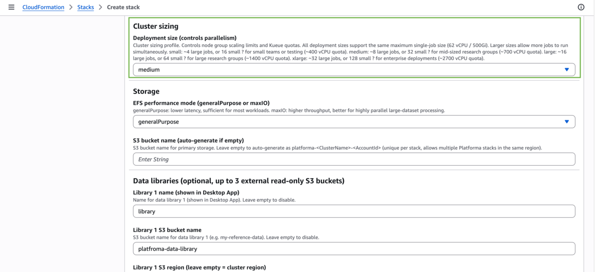
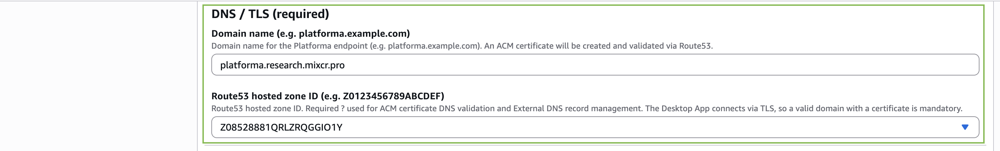
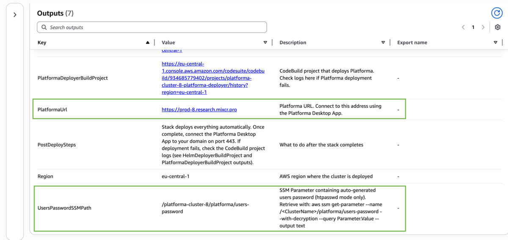
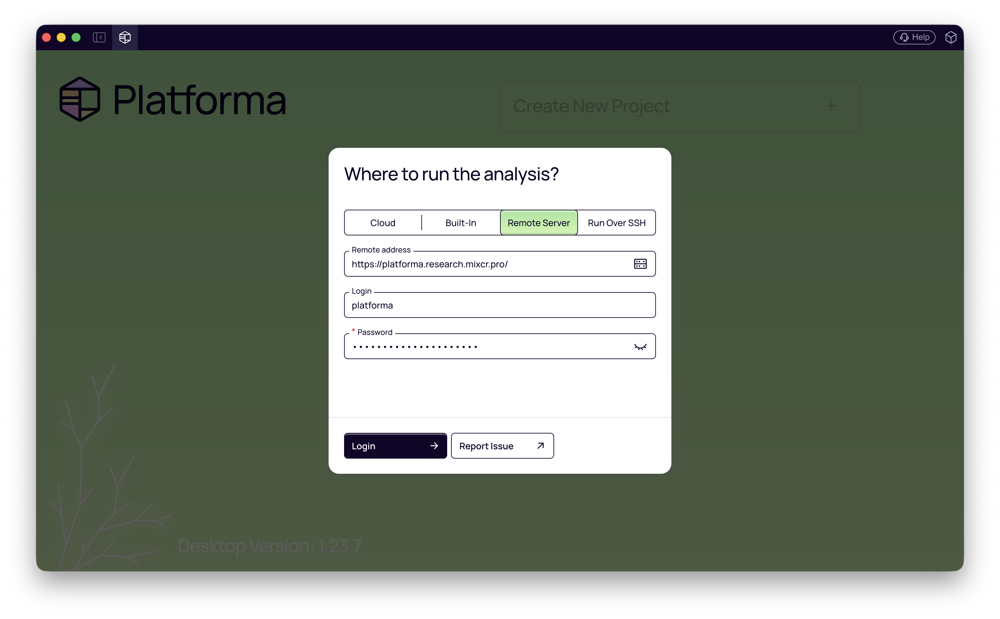

# Platforma on AWS EKS

A single CloudFormation stack creates all infrastructure (EKS, EFS, S3, IAM) and installs all Kubernetes components (Kueue, Cluster Autoscaler, ALB Controller, External DNS, Platforma) via CodeBuild.

> For manual CLI setup, see [Advanced installation](advanced-installation.md).

## Architecture



## What you'll do

1. **Deploy the CloudFormation stack** — fill in parameters in the AWS Console, click Create. Takes ~20 minutes.
2. **Retrieve the password** — the stack auto-generates credentials and stores them in SSM Parameter Store.
3. **Connect the Desktop App** — open the Platforma Desktop App and connect to your domain.

Everything runs in the AWS Console. The stack handles infrastructure, Helm installs, certificate validation, and DNS records.

## Prerequisites

- **AWS account** with permissions to create EKS, EFS, S3, IAM roles, ACM certificates, CodeBuild (see [permissions.md](permissions.md))
- **Route53 hosted zone** with a registered domain (e.g. `example.com`) — the Desktop App requires TLS, so you need a domain and certificate. If you don't have one, see [How to register a domain in AWS](domain-guide.md).
- **Platforma license key**
- **Platforma Desktop App** — download from [platforma.bio](https://platforma.bio)

## Step 1: Deploy CloudFormation stack

Open the AWS Console and navigate to **CloudFormation → Create Stack → With new resources**.

Get the template using one of these options:
- **S3 URL** (easiest) — paste this URL directly in the CloudFormation Console: `https://platforma-cloudformation.s3.eu-central-1.amazonaws.com/cloudformation-v1.yaml`
- **Upload** — clone the [platforma-helm](https://github.com/milaboratory/platforma-helm) repository and upload `infrastructure/aws/cloudformation.yaml`

Fill in the parameters below.



### Cluster parameters

| Parameter | Default | Description |
|-----------|---------|-------------|
| Cluster name | `platforma-cluster` | EKS cluster name |
| Kubernetes version | `1.34` | EKS version |
| Platforma namespace | `platforma` | Kubernetes namespace for Platforma |

### Networking

| Parameter | Default | Description |
|-----------|---------|-------------|
| VPC ID | *(empty = create new)* | Leave empty to create a new VPC, or provide an existing VPC ID |
| Private subnet IDs | *(leave as-is)* | 3 private subnets (one per AZ) — required when using an existing VPC. The field shows `,,` by default — **do not clear it**; CloudFormation needs this placeholder when creating a new VPC. |
| Public subnet IDs | *(leave as-is)* | 3 public subnets — required for ALB when using an existing VPC. Same `,,` placeholder applies. |
| VPC CIDR | `10.0.0.0/16` | CIDR for the new VPC (ignored with existing VPC) |



### Storage

| Parameter | Default | Description |
|-----------|---------|-------------|
| EFS performance mode | `generalPurpose` | `maxIO` for very high throughput |
| S3 bucket name | *(auto-generated)* | Auto-generates as `platforma-<ClusterName>-<AccountId>` |

### Platforma deployment

| Parameter | Default | Description |
|-----------|---------|-------------|
| Deploy Platforma | `true` | Set to `true` to deploy Platforma after infrastructure is ready. When `false`, the stack deploys only infrastructure and controllers — useful for testing first. |
| License key | *(empty)* | Platforma license key (`MI_LICENSE` value). Required when Deploy Platforma is `true`. |
| Platforma version | `3.0.0` | Helm chart version from `oci://ghcr.io/milaboratory/platforma-helm/platforma` |
| Custom container image | *(empty)* | Override the default Platforma container image. Leave empty to use the chart default. |

### Authentication

| Parameter | Default | Description |
|-----------|---------|-------------|
| Auth method | `htpasswd` | `htpasswd` for file-based auth, `ldap` for LDAP |
| Htpasswd content | *(empty)* | Pre-generated htpasswd string. When empty, the stack generates a random password and stores it in SSM Parameter Store (see Step 2). Generate manually with `htpasswd -nB username`. |

For LDAP, fill in the LDAP parameters (server URL, bind DN, search rules). See the parameter descriptions in the CloudFormation Console for details.



### Cluster sizing

| Parameter | Default | Description |
|-----------|---------|-------------|
| Deployment size | `small` | Controls node group scaling limits and Kueue quotas. All sizes support the same max single-job size (62 vCPU / 500 GiB). |

| Size | Max single-job | Approximate parallelism | Recommended vCPU quota |
|------|---------------|------------------------|----------------------|
| `small` | 62 vCPU / 500 GiB | ~4 large or ~16 small jobs | ~400 |
| `medium` | 62 vCPU / 500 GiB | ~8 large or ~32 small jobs | ~700 |
| `large` | 62 vCPU / 500 GiB | ~16 large or ~64 small jobs | ~1400 |
| `xlarge` | 62 vCPU / 500 GiB | ~32 large or ~128 small jobs | ~2700 |

Before deploying, check that your AWS On-Demand vCPU quota meets the recommended minimum. Request an increase at [Service Quotas console](https://console.aws.amazon.com/servicequotas/home/services/ec2/quotas/L-1216C47A) if needed. The stack checks the quota during deployment and fails with an error if it is too low.

### Data libraries (optional)

Up to 3 external S3 data libraries can be configured. Each library needs a name and S3 bucket. Access keys are optional — when omitted, the chart creates an IRSA role for read-only access.

| Parameter | Description |
|-----------|-------------|
| Library name | Display name in the Desktop App |
| Library bucket | S3 bucket name |
| Library region | S3 region — required if bucket is in a different region than the cluster |
| Access key / Secret key | Leave both empty for IRSA mode, or provide both for explicit credentials |



### DNS / TLS (required)

| Parameter | Description |
|-----------|-------------|
| **Route53 hosted zone ID** | Your hosted zone ID (e.g. `Z0123456789ABCDEF`) |
| **Domain name** | Endpoint for Platforma (e.g. `platforma.example.com`) |

Both fields are **required**. The Desktop App requires TLS with a valid certificate — IP addresses and self-signed certificates do not work.

You need a domain you own (e.g. `platforma.example.com`) and a Route53 hosted zone for it. The stack requests an ACM certificate and validates it automatically by writing a DNS record to your hosted zone.

If you don't have a domain yet, see [How to register a domain in AWS](domain-guide.md).



### Create the stack

Click **Create Stack**. The stack takes **~20 minutes**. During this time it:

1. Creates the EKS cluster, node groups, VPC (if needed), EFS, S3 bucket, IAM roles
2. Installs Kueue, AppWrapper, Cluster Autoscaler, ALB Controller, External DNS via CodeBuild
3. If `DeployPlatforma=true`: installs Platforma, creates the namespace, license secret, and auth secret

Once complete, go to the **Outputs** tab:

| Output | Description |
|--------|-------------|
| `PlatformaUrl` | URL to connect from the Desktop App |
| `UsersPasswordSSMPath` | SSM path for auto-generated password (htpasswd mode) |
| `ClusterName` | EKS cluster name (for kubectl access) |
| `Region` | AWS region |
| `HelmDeployerBuildProject` | CodeBuild logs for infra controllers |
| `PlatformaDeployerBuildProject` | CodeBuild logs for Platforma deployment |



---

## Step 2: Retrieve the password

If you left `HtpasswdContent` empty, the stack generated a random password and stored it in SSM Parameter Store.

**Via AWS Console:** Go to **Systems Manager → Parameter Store**, find the parameter shown in the `UsersPasswordSSMPath` output, click **Show** to reveal the value.

**Via CLI:**

```bash
aws ssm get-parameter \
  --name "<UsersPasswordSSMPath>" \
  --with-decryption \
  --query Parameter.Value \
  --output text \
  --region <Region>
```

Replace `<UsersPasswordSSMPath>` and `<Region>` with the values from the Outputs tab.

The username is `platforma`. The stack generates the password once and reuses it on subsequent deploys.

---

## Step 3: Connect from Desktop App

1. **Open** the Platforma Desktop App (download from [platforma.bio](https://platforma.bio) if needed)
2. **Add** a new connection
3. **Enter** the `PlatformaUrl` from the Outputs tab (e.g. `https://platforma.example.com`)
4. **Log in** with username `platforma` and the password from Step 2



ALB provisioning and DNS propagation take 1-3 minutes after the stack completes. If the connection fails right away, wait and retry.

---

## Updating Platforma

Change the `PlatformaVersion` parameter in the CloudFormation Console and update the stack. Only the Platforma deployer CodeBuild project runs — infrastructure stays unchanged.

The auto-generated password persists across updates. The deployer reads it from SSM on each deploy.

---

## Troubleshooting

### Stack stuck in CREATE_IN_PROGRESS after 20+ minutes

The most common cause is ACM certificate validation failure. The stack creates an ACM certificate and validates it by writing a DNS record to your Route53 hosted zone. This fails silently if the hosted zone ID is wrong or the domain's NS records point elsewhere.

Check certificate status in the AWS Console → **Certificate Manager** → your domain. If the certificate shows `PENDING_VALIDATION` after 5+ minutes, verify:
1. The **Route53 hosted zone ID** parameter matches the actual zone that controls your domain's DNS
2. Your domain's NS records are delegated to Route53

### CodeBuild deployment failed

Check the CodeBuild project logs — links are in the Outputs tab (`HelmDeployerBuildProject` and `PlatformaDeployerBuildProject`). Common causes:

- **License key missing or invalid** — `LicenseKey` parameter is required when `DeployPlatforma=true`
- **Helm chart version not found** — verify the `PlatformaVersion` parameter matches a published chart version
- **vCPU quota exceeded** — the stack checks your AWS On-Demand vCPU quota before deploying. If it's too low, request an increase at [Service Quotas console](https://console.aws.amazon.com/servicequotas/home/services/ec2/quotas/L-1216C47A)

---

## Cleanup

Delete the CloudFormation stack: **CloudFormation → Stacks → select your stack → Delete**. The stack uninstalls all Helm releases, waits for ALB deprovisioning, and cleans up DNS records before deleting infrastructure.

**S3 and EFS persist** after stack deletion to protect data. Delete them manually when you no longer need the data:

1. **S3 bucket** — go to **S3** in the Console, find the bucket (named `platforma-<ClusterName>-<AccountId>`), empty it, then delete it
2. **EFS filesystem** — go to **EFS** in the Console, find the filesystem (tagged with the cluster name), delete it
