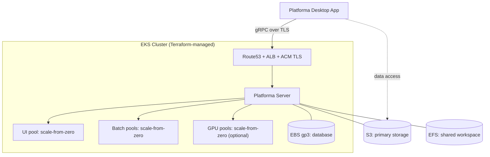

# Platforma on AWS EKS — Terraform

Plain HashiCorp Terraform (also runs under OpenTofu) for deploying Platforma on a
new EKS cluster. It is a faithful, declarative reproduction of the
[CloudFormation template](../cloudformation/README.md) (`cloudformation-eks-1-35.yaml`), split into
two modules you apply in order.

## When to use this path

Use the Terraform modules when you manage AWS infrastructure with Terraform and
want a deployment you can read, diff, and adapt — rather than a black-box
CloudFormation stack driven by CodeBuild. The two paths produce the same
cluster, controllers, and Platforma release; pick the one that fits how your
team works.

- **Greenfield only.** Like the CloudFormation path, these modules create and
  own a new EKS cluster end to end. Do **not** point them at a pre-existing
  cluster you already manage — see [advanced-installation.md](../cloudformation/advanced-installation.md)
  for integrating the Helm chart into an existing cluster instead.
- **Bring-your-own VPC is supported.** The cluster itself is always
  Terraform-managed, but you can deploy into existing subnets (see
  [Networking](#networking-greenfield-or-bring-your-own-vpc)).

## Architecture



## Why two modules

| Module | Creates | Providers |
|--------|---------|-----------|
| `infra` | VPC (optional), EKS cluster + node groups, IAM/IRSA roles, EFS, S3, ECR pull-through cache, ACM certificate | `aws` only |
| `platforma` | In-cluster controllers (Kueue, AppWrapper, Cluster Autoscaler, and — with ingress — ALB Controller + External DNS) and the Platforma Helm release | `aws`, `kubernetes`, `helm`, `kubectl` |

The split exists because the Kubernetes/Helm providers must be configured from a
cluster that **already exists**. `platforma` resolves the cluster
endpoint, IAM role ARNs, EFS id, and ACM cert through plan-time `data` sources,
so its providers get concrete values instead of unknowns. Applying everything in
one state would force the providers to depend on resources created in the same
run — the classic Terraform chicken-and-egg.

Each module is independently `plan`/`apply`-able and keeps its own state.

## Prerequisites

- **Terraform ≥ 1.5** or **OpenTofu ≥ 1.6**. Commands below show `terraform`;
  substitute `tofu` if you use OpenTofu.
- **AWS CLI v2** on the machine running Terraform. The `kubernetes`/`helm`/
  `kubectl` providers authenticate to EKS via the `aws eks get-token` exec
  plugin, so the CLI must be installed and on `PATH`.
- **AWS credentials** with permissions to create EKS, EC2/VPC, EFS, S3, IAM,
  ACM, and ECR resources (see [permissions.md](../cloudformation/permissions.md)).
- **Route53 hosted zone** for your domain — required when `ingress_enabled =
  true` (the default). The ACM certificate is DNS-validated through this zone
  and External DNS manages the record. No zone? See [domain-guide.md](../cloudformation/domain-guide.md).
- **Platforma license key** — request at [platforma.bio/getlicense](https://platforma.bio/getlicense)
  or email [licensing@milaboratories.com](mailto:licensing@milaboratories.com).
- **kubectl** (optional) — handy for retrieving credentials and inspecting the
  cluster after apply.

## State backend

Neither module declares a `backend` block — wire your own (an S3 bucket with
DynamoDB locking is typical) before the first apply:

```hcl
# backend.tf in each module directory
terraform {
  backend "s3" {
    bucket         = "my-tf-state"
    key            = "platforma/infra.tfstate"      # ...and platforma.tfstate
    region         = "eu-central-1"
    dynamodb_table = "my-tf-locks"
  }
}
```

State holds secrets (the license key, htpasswd hash, any data-library keys).
Use an encrypted, access-controlled backend.

## Quickstart

### Step 1 — infrastructure

```bash
cd infra
cp terraform.tfvars.example terraform.tfvars
$EDITOR terraform.tfvars          # set region, domain_name, route53_zone_id, ...

terraform init
terraform plan
terraform apply                   # ~15-20 min (EKS + node groups)
```

Capture the bucket name the platforma module needs:

```bash
terraform output -raw s3_bucket_name
```

### Step 2 — pre-stage the master secret

The platforma module reads a Platforma **master secret** from an SSM
SecureString parameter you stage beforehand. It's the chart's root key
for two independent features: encryption of sensitive data persisted in
the platform DB, and signing/validation of user sessions and resource
signatures (see `charts/platforma/values.yaml` lines 58-78).

> **Rotating the master secret invalidates all DB-encrypted secrets and
> all active sessions.** Treat it as a long-lived root key.

Terraform does **not** create the parameter and does **not** generate
the value — it only reads the latest version. You stage both before
the next step:

```bash
PARAM_NAME="/${CLUSTER_NAME}/platforma/master-secret"

# Generate a fresh 32-byte value (or pipe in your own payload to pin a
# known secret).
aws ssm put-parameter \
  --name "${PARAM_NAME}" \
  --type SecureString \
  --region "${AWS_REGION}" \
  --value "$(openssl rand -base64 32)"

# Wire it into the platforma module.
cat >> platforma/terraform.tfvars <<EOF
master_secret_ssm_parameter_name = "${PARAM_NAME}"
EOF
```

`master_secret_ssm_parameter_name` has no default — `terraform plan`
fails without it.

The CloudFormation deployer runs the equivalent step automatically
inside CodeBuild; only this TF path requires the manual
`aws ssm put-parameter`.

### Step 3 — controllers + Platforma

```bash
cd ../platforma
cp terraform.tfvars.example terraform.tfvars
$EDITOR terraform.tfvars          # match Step 1's shared identifiers;
                                  # set s3_bucket_name (from above) + license_key
                                  # (master_secret_ssm_parameter_name already
                                  # appended by Step 2)

terraform init
terraform plan                    # needs AWS creds AND an applied Step 1
terraform apply                   # ~5-10 min
```

> The shared identifiers (`region`, `cluster_name`, `platforma_namespace`,
> `helm_release_name`, `deployment_size`, `enable_gpu`, `ingress_enabled`,
> `domain_name`, `route53_zone_id`, `data_libraries`) **must be identical** in
> both `terraform.tfvars` files — the IRSA trust policies, ACM cert, ECR cache,
> and Kueue quotas from Step 1 are keyed to those exact values.

### Step 4 — connect

```bash
terraform output                  # platforma_url + how to fetch the password

# htpasswd auto-generated a 'platforma' user; fetch the password:
eval "$(terraform output -raw htpasswd_password_command)"
```

Open the Platforma Desktop App and connect to `platforma_url`. DNS and the ALB
take a few minutes to come up after apply.

## Master secret operations

The master secret is staged in Step 2 — see there for the initial setup.
Day-2 operations:

**Rotation.** Add a new version out-of-band; Terraform reads `latest`
on the next plan, no state import needed.

```bash
aws ssm put-parameter \
  --name "${PARAM_NAME}" \
  --type SecureString \
  --overwrite \
  --region "${AWS_REGION}" \
  --value "$(openssl rand -base64 32)"

terraform apply
```

Rotation invalidates DB-encrypted data and active sessions — do it
deliberately.

**Re-apply / state-loss stability.** SSM Parameter Store is the source
of truth, so rebuilding Terraform state from scratch no longer rotates
the master secret.

**Destroy.** `terraform destroy` no longer touches the SSM parameter
(Terraform doesn't own it). If you really want it gone, delete it
explicitly:

```bash
aws ssm delete-parameter --name "${PARAM_NAME}" --region "${AWS_REGION}"
```

**Backup.** Before deleting the parameter, save the value off-cluster
if you might want to restore the stack with DB-encrypted data intact:

```bash
aws ssm get-parameter \
  --name "${PARAM_NAME}" \
  --with-decryption \
  --region "${AWS_REGION}" \
  --query Parameter.Value --output text > /path/to/secure/backup
```

## Networking: greenfield or bring-your-own VPC

- **New VPC (default):** leave `vpc_id` empty. A VPC (`vpc_cidr`, default
  `10.0.0.0/16`) with public + private subnets across 3 AZs is created.
- **Existing VPC:** set `vpc_id` and provide exactly **3 private** subnet IDs
  (nodes + EFS mount targets) and **3 public** subnet IDs (the internet-facing
  ALB) — one per AZ. Three are required because EFS places one mount target per
  AZ and EKS spreads nodes across AZs.

## Customization

- **Deployment size** — `deployment_size` (`small`/`medium`/`large`/`xlarge`)
  sets node-group MaxSize and the Kueue ClusterQueue quotas. All sizes share the
  same max single-job size (62 vCPU / 484 GiB).
- **GPU** — `enable_gpu` provisions scale-from-zero GPU node groups (no cost
  when idle). Set `false` in regions without g6/g6e capacity.
- **Authentication** — `auth_method = "htpasswd"` (default) auto-generates a
  single `platforma` user (password in SSM) or accepts your own
  `htpasswd_content` (bcrypt recommended, e.g. `htpasswd -nB user`).
  `auth_method = "ldap"` wires the chart's LDAP support.
- **Data libraries** — `data_libraries` exposes external S3 buckets in the
  Desktop App. Entries without `access_key` use the Platforma IRSA role (bucket
  must be in this account); entries with credentials become Kubernetes Secrets.
  Pass the **same list** to both modules. `enable_demo_data_library` (default
  `true`) adds MiLaboratories' read-only demo dataset.
- **Chart source** — pinned by `chart_version` from
  `oci://ghcr.io/milaboratory/platforma-helm/platforma` by default. Set
  `chart_local_path` to install from a local chart directory or `.tgz`
  (development / air-gapped). `platforma_image` overrides the container image.

## Controllers-only mode

Set `deploy_platforma = false` in the platforma module to install just the
controllers (Kueue, AppWrapper, Cluster Autoscaler, and the ingress stack) —
useful for staging the cluster before the first application rollout. Re-apply
with `deploy_platforma = true` (and a `license_key`) to add Platforma.

## Upgrades

- **Platforma chart** — bump `chart_version` and `terraform apply` the platforma
  module. `--atomic` rolls back a failed upgrade.
- **Controller / Kubernetes versions** — pinned in
  [`platforma/controllers.tf`](platforma/controllers.tf)
  and the infra module; bump and re-apply the relevant module. The header
  comments note what must move together.

## Teardown

Destroy in reverse order — the platforma module first (it depends on the
cluster), then infra:

```bash
terraform -chdir=platforma destroy
terraform -chdir=infra destroy
```

The primary S3 bucket holds user result data and is **retained** by default
(`s3_force_destroy = false`, mirroring CloudFormation's Retain policy). Empty it
manually, or set `s3_force_destroy = true` before destroy, to remove it.

## Relationship to the CloudFormation template

These modules mirror `cloudformation-eks-1-35.yaml` deliberately: same EKS
version, controller versions, node-group shapes, GPU scale-from-zero tags,
Kueue quotas, and Platforma values. The notable differences are mechanical, not
behavioral:

- No CodeBuild / Lambda. Helm and manifests are applied by Terraform's `helm`
  and `kubectl` providers.
- htpasswd hashes use Terraform's built-in `bcrypt()` (the chart consumes
  bcrypt) instead of CloudFormation's apr1 convenience hashing.
- The AppWrapper `install.yaml` is integrity-checked against a pinned SHA-256
  before apply.

Versions are duplicated from the template; the header comments in each file flag
what to keep in sync on a bump.
