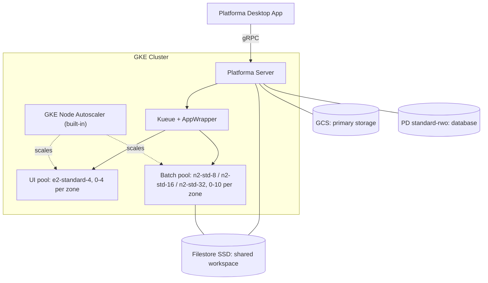
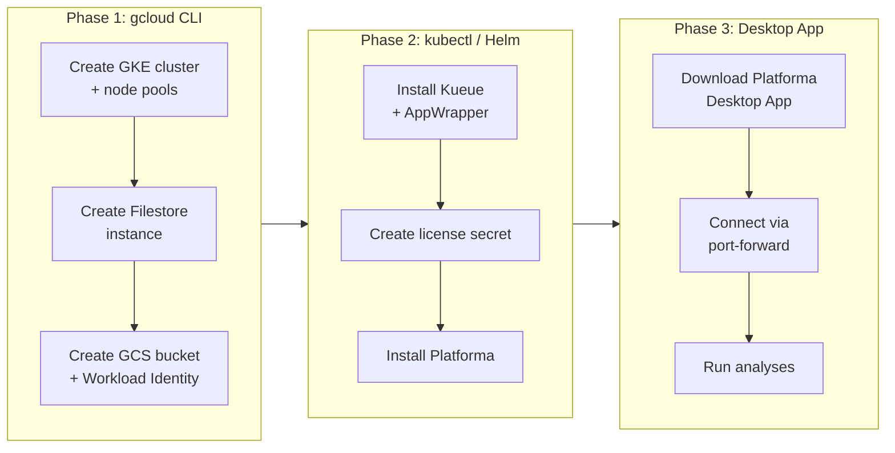
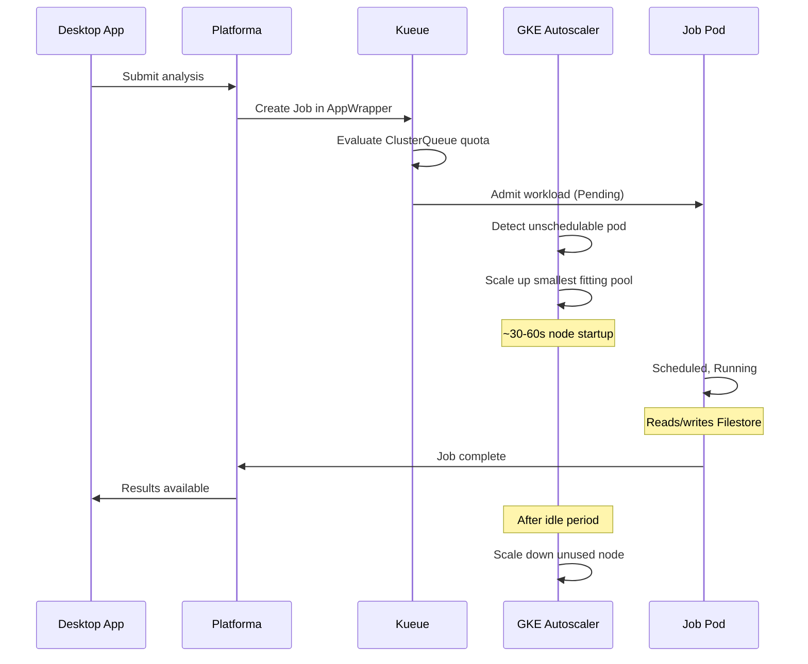

# Platforma on GCP GKE

Deploy Platforma on GCP using the gcloud CLI and Helm.

> For full customization (production ingress, TLS, automation), see [Advanced installation](advanced-installation.md).

## Architecture



## Deployment overview



## Prerequisites

- **GCP project** with billing enabled
- **gcloud CLI** configured with appropriate permissions (see [permissions.md](permissions.md))
- **kubectl** v1.28+
- **Helm** v3.12+
- **Platforma license key**
- **Platforma Desktop App** -- download from [platforma.bio](https://platforma.bio) before starting

## Files in this directory

| File | Description |
|------|-------------|
| `kueue-values.yaml` | Kueue Helm values with AppWrapper enabled |
| `permissions.md` | GCP permissions and recommended resource configuration |
| `values-gcp-gcs.yaml` | Platforma Helm values for GKE with GCS primary storage |
| `advanced-installation.md` | Automation-friendly setup with ingress and TLS |

---

## Step 1: Set variables

```bash
export PROJECT_ID="your-project-id"
export REGION="europe-west3"
export ZONE="europe-west3-a"
export CLUSTER_NAME="platforma-cluster"
```

---

## Step 2: Create GKE cluster

```bash
# Create cluster with system node pool (1 node per zone = 3 total)
gcloud container clusters create $CLUSTER_NAME \
  --project=$PROJECT_ID \
  --region=$REGION \
  --release-channel=regular \
  --num-nodes=1 \
  --machine-type=e2-standard-4 \
  --node-labels=pool=system \
  --workload-pool=${PROJECT_ID}.svc.id.goog \
  --enable-ip-alias

# Add UI node pool (scales 0-4 per zone)
gcloud container node-pools create ui \
  --project=$PROJECT_ID \
  --region=$REGION \
  --cluster=$CLUSTER_NAME \
  --machine-type=e2-standard-4 \
  --num-nodes=0 \
  --enable-autoscaling \
  --min-nodes=0 \
  --max-nodes=4 \
  --node-labels=pool=ui \
  --node-taints=dedicated=ui:NoSchedule

# Add batch-medium node pool (8 vCPU, scales 0-10 per zone)
gcloud container node-pools create batch-medium \
  --project=$PROJECT_ID \
  --region=$REGION \
  --cluster=$CLUSTER_NAME \
  --machine-type=n2-standard-8 \
  --num-nodes=0 \
  --enable-autoscaling \
  --min-nodes=0 \
  --max-nodes=10 \
  --node-labels=pool=batch \
  --node-taints=dedicated=batch:NoSchedule

# Add batch-large node pool (16 vCPU, scales 0-10 per zone)
gcloud container node-pools create batch-large \
  --project=$PROJECT_ID \
  --region=$REGION \
  --cluster=$CLUSTER_NAME \
  --machine-type=n2-standard-16 \
  --num-nodes=0 \
  --enable-autoscaling \
  --min-nodes=0 \
  --max-nodes=10 \
  --node-labels=pool=batch \
  --node-taints=dedicated=batch:NoSchedule

# Add batch-xlarge node pool (32 vCPU, scales 0-10 per zone)
gcloud container node-pools create batch-xlarge \
  --project=$PROJECT_ID \
  --region=$REGION \
  --cluster=$CLUSTER_NAME \
  --machine-type=n2-standard-32 \
  --num-nodes=0 \
  --enable-autoscaling \
  --min-nodes=0 \
  --max-nodes=10 \
  --node-labels=pool=batch \
  --node-taints=dedicated=batch:NoSchedule
```

GKE regional clusters span 3 zones. `--num-nodes` and `--max-nodes` are **per zone**: `--num-nodes=1` creates 3 system nodes total, and `--max-nodes=10` allows up to 30 batch nodes per pool. All three batch pools share the same label (`pool=batch`) and taint (`dedicated=batch:NoSchedule`). GKE's built-in autoscaler selects the smallest pool that fits each pending pod -- no separate Cluster Autoscaler needed.

Get credentials:

```bash
gcloud container clusters get-credentials $CLUSTER_NAME \
  --project=$PROJECT_ID \
  --region=$REGION
```

Verify:

```bash
kubectl get nodes -L pool
```

You should see 3 system nodes.

---

## Step 3: Create Filestore instance

Filestore BASIC_SSD is zonal -- cross-zone access works but adds latency.

```bash
# 2560 GB = BASIC_SSD minimum (2.5 TiB)
gcloud filestore instances create platforma-filestore \
  --project=$PROJECT_ID \
  --zone=$ZONE \
  --tier=BASIC_SSD \
  --file-share=name=vol1,capacity=2560GB \
  --network=name=default

# Get Filestore IP
FILESTORE_IP=$(gcloud filestore instances describe platforma-filestore \
  --project=$PROJECT_ID \
  --zone=$ZONE \
  --format="value(networks[0].ipAddresses[0])")

echo "Filestore IP: $FILESTORE_IP"
```

---

## Step 4: Create GCS bucket and Workload Identity

```bash
# Create GCS bucket
gcloud storage buckets create gs://platforma-storage-${PROJECT_ID} \
  --project=$PROJECT_ID \
  --location=$REGION

# Block public access
gcloud storage buckets update gs://platforma-storage-${PROJECT_ID} \
  --no-public-access

# Create GSA
gcloud iam service-accounts create platforma-access \
  --project=$PROJECT_ID \
  --display-name="Platforma GKE Workload"

GSA_EMAIL="platforma-access@${PROJECT_ID}.iam.gserviceaccount.com"

# Grant GCS bucket access
gcloud storage buckets add-iam-policy-binding gs://platforma-storage-${PROJECT_ID} \
  --member="serviceAccount:${GSA_EMAIL}" \
  --role=roles/storage.objectAdmin

# Bind KSA to GSA via Workload Identity
gcloud iam service-accounts add-iam-policy-binding $GSA_EMAIL \
  --project=$PROJECT_ID \
  --role=roles/iam.workloadIdentityUser \
  --member="serviceAccount:${PROJECT_ID}.svc.id.goog[platforma/platforma]"

# Create namespace and K8s service account
kubectl create namespace platforma
kubectl create serviceaccount platforma -n platforma
kubectl annotate serviceaccount platforma -n platforma \
  iam.gke.io/gcp-service-account=${GSA_EMAIL}
```

Verify:

```bash
kubectl describe sa platforma -n platforma | grep iam.gke.io
```

---

## Step 5: Install Kueue and AppWrapper

```bash
helm install kueue oci://registry.k8s.io/kueue/charts/kueue \
  --version 0.16.1 \
  -n kueue-system --create-namespace \
  -f kueue-values.yaml
```

Wait for readiness:

```bash
kubectl wait --for=condition=Available deployment/kueue-controller-manager \
  -n kueue-system --timeout=120s
```

### Install AppWrapper CRD and controller

```bash
kubectl apply --server-side -f https://github.com/project-codeflare/appwrapper/releases/download/v1.1.2/install.yaml

kubectl wait --for=condition=Available deployment/appwrapper-controller-manager \
  -n appwrapper-system --timeout=120s
```

Verify:

```bash
kubectl get pods -n kueue-system
kubectl get pods -n appwrapper-system
kubectl get crd appwrappers.workload.codeflare.dev
```

---

## Step 6: Create license secret

```bash
kubectl create secret generic platforma-license \
  -n platforma \
  --from-literal=MI_LICENSE="your-license-key"
```

---

## Step 7: Install Platforma

```bash
helm install platforma oci://ghcr.io/milaboratory/platforma-helm/platforma \
  --version 3.0.0 \
  -n platforma \
  -f values-gcp-gcs.yaml \
  --set storage.workspace.filestore.ip=$FILESTORE_IP \
  --set storage.workspace.filestore.location=$ZONE \
  --set storage.main.gcs.bucket=platforma-storage-${PROJECT_ID} \
  --set storage.main.gcs.projectId=$PROJECT_ID
```

Verify:

```bash
kubectl get pods -n platforma
kubectl get pvc -n platforma
kubectl get clusterqueues
kubectl get localqueues -n platforma
```

---

## Step 8: Connect from Desktop App

1. **Open** the Platforma Desktop App (download from [platforma.bio](https://platforma.bio) if needed)
2. **Forward** the gRPC port:

```bash
kubectl port-forward svc/platforma -n platforma 6345:6345
```

3. **Add** a new connection in the Desktop App
4. **Enter** `localhost:6345` as the endpoint

For production access with TLS and a domain name, see the [ingress options in the advanced guide](advanced-installation.md#step-7-configure-ingress).

---

## How it works



### Scaling performance

| Operation | Duration | Notes |
|-----------|----------|-------|
| Scale-up (0 to 1 node) | ~30-60s | GKE autoscaler + node provisioning |
| Scale-down | 10+ min | Configurable via autoscaling profile |

---

## Verification checklist

Run after completing all steps:

```bash
echo "=== Cluster Nodes ==="
kubectl get nodes -L pool

echo ""
echo "=== Kueue ==="
kubectl get pods -n kueue-system

echo ""
echo "=== AppWrapper Controller ==="
kubectl get pods -n appwrapper-system

echo ""
echo "=== AppWrapper CRD ==="
kubectl get crd appwrappers.workload.codeflare.dev

echo ""
echo "=== Kueue Resources ==="
kubectl get resourceflavors,clusterqueues,localqueues --all-namespaces

echo ""
echo "=== Platforma ==="
kubectl get pods -n platforma
kubectl get pvc -n platforma
```

Expected:
- 3 system nodes, 0 batch/UI nodes (scale on demand)
- Kueue controller pod running
- AppWrapper controller pod running
- AppWrapper CRD exists
- ResourceFlavors, ClusterQueues, LocalQueues created
- Platforma pod running with PVCs bound

---

## Troubleshooting

### Pods stuck in Pending

```bash
# Check if Kueue admitted the workload
kubectl get workloads -A

# Check node pool scaling
gcloud container node-pools describe batch-medium \
  --project=$PROJECT_ID \
  --region=$REGION \
  --cluster=$CLUSTER_NAME
```

### Filestore mount failures

```bash
# Verify Filestore instance
gcloud filestore instances describe platforma-filestore \
  --project=$PROJECT_ID \
  --zone=$ZONE

# Check Filestore IP reachability from a pod
kubectl run --rm -it --restart=Never test-nfs --image=busybox -- sh -c "ping -c 3 $FILESTORE_IP"
```

### Filestore workspace permission denied

Filestore mounts as `root:root`. Enable `chownOnInit: true` in values (already set in `values-gcp-gcs.yaml`). This runs an init container that sets ownership to UID/GID 1010 before the main container starts.

### AppWrapper not transitioning

```bash
kubectl get appwrapper <name> -o yaml
kubectl logs -n appwrapper-system -l control-plane=controller-manager --tail=50
```

---

## Cleanup

If running cleanup in a new shell, re-export the variables from Step 1, plus:

```bash
GSA_EMAIL="platforma-access@${PROJECT_ID}.iam.gserviceaccount.com"
```

```bash
# Delete Helm releases
helm uninstall platforma -n platforma
helm uninstall kueue -n kueue-system
kubectl delete -f https://github.com/project-codeflare/appwrapper/releases/download/v1.1.2/install.yaml

# Remove IAM bindings then delete GSA
gcloud storage buckets remove-iam-policy-binding gs://platforma-storage-${PROJECT_ID} \
  --member="serviceAccount:${GSA_EMAIL}" \
  --role=roles/storage.objectAdmin
gcloud iam service-accounts remove-iam-policy-binding $GSA_EMAIL \
  --project=$PROJECT_ID \
  --role=roles/iam.workloadIdentityUser \
  --member="serviceAccount:${PROJECT_ID}.svc.id.goog[platforma/platforma]"
gcloud iam service-accounts delete $GSA_EMAIL --project=$PROJECT_ID --quiet

# Delete GCS bucket (WARNING: destroys all stored data)
gcloud storage rm --recursive gs://platforma-storage-${PROJECT_ID}
gcloud storage buckets delete gs://platforma-storage-${PROJECT_ID}

# Delete Filestore
gcloud filestore instances delete platforma-filestore \
  --project=$PROJECT_ID \
  --zone=$ZONE \
  --quiet

# Delete cluster (removes all node pools)
gcloud container clusters delete $CLUSTER_NAME \
  --project=$PROJECT_ID \
  --region=$REGION \
  --quiet
```
