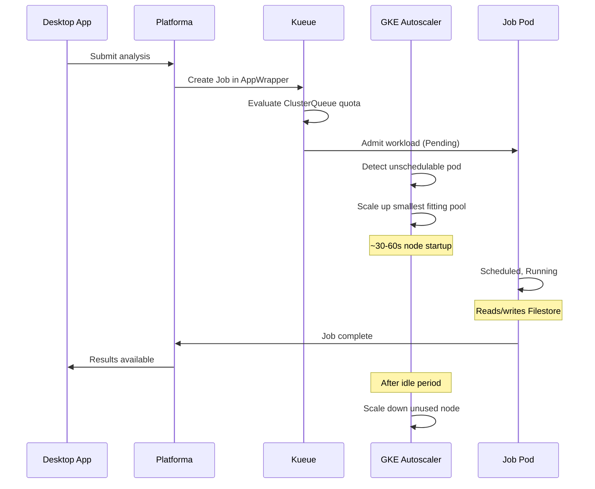

# Advanced installation (manual CLI)

Manual setup using gcloud CLI and Helm with full control over every resource. For custom ingress, automation pipelines, or understanding every parameter.

For the guided setup, see the [main guide](README.md).

## Prerequisites

- gcloud CLI configured with deployer permissions (see [permissions.md](permissions.md))
- kubectl v1.28+
- Helm v3.12+
- A domain name for TLS (if configuring ingress)

## Configuration

Set these variables first. Every step references them.

```bash
# --- Required: edit these ---
export PROJECT_ID="your-project-id"
export REGION="europe-west3"
export ZONE="europe-west3-a"                   # Filestore zone (within REGION)
export CLUSTER_NAME="platforma-cluster"
export MI_LICENSE="your-license-key"

# --- Optional: defaults work for most setups ---
export PLATFORMA_NAMESPACE="platforma"
export PLATFORMA_VERSION="3.0.0"
export GCS_BUCKET="platforma-storage-${PROJECT_ID}"
export DOMAIN_NAME="platforma.example.com"     # For ingress/TLS (Step 7)

# --- Derived: do not edit ---
export GSA_EMAIL="platforma-access@${PROJECT_ID}.iam.gserviceaccount.com"
```

Verify your configuration:

```bash
echo "Project:    $PROJECT_ID"
echo "Region:     $REGION"
echo "Zone:       $ZONE"
echo "Cluster:    $CLUSTER_NAME"
echo "GCS bucket: $GCS_BUCKET"
echo "GSA:        $GSA_EMAIL"
echo "Namespace:  $PLATFORMA_NAMESPACE"
```

## Files reference

| File | Description |
|------|-------------|
| `kueue-values.yaml` | Kueue Helm values with AppWrapper enabled |
| `values-gcp-gcs.yaml` | Platforma Helm values for GKE with GCS primary storage |

---

## Step 1: Create GKE cluster

```bash
# Create cluster with system node pool (1 node per zone = 3 total)
gcloud container clusters create $CLUSTER_NAME \
  --project=$PROJECT_ID \
  --region=$REGION \
  --release-channel=regular \
  --num-nodes=1 \
  --machine-type=e2-standard-4 \
  --node-labels=pool=system \
  --workload-pool=${PROJECT_ID}.svc.id.goog \
  --enable-ip-alias

# Add UI node pool
gcloud container node-pools create ui \
  --project=$PROJECT_ID \
  --region=$REGION \
  --cluster=$CLUSTER_NAME \
  --machine-type=e2-standard-4 \
  --num-nodes=0 \
  --enable-autoscaling \
  --min-nodes=0 \
  --max-nodes=4 \
  --node-labels=pool=ui \
  --node-taints=dedicated=ui:NoSchedule

# Add batch-medium node pool (8 vCPU)
gcloud container node-pools create batch-medium \
  --project=$PROJECT_ID \
  --region=$REGION \
  --cluster=$CLUSTER_NAME \
  --machine-type=n2-standard-8 \
  --num-nodes=0 \
  --enable-autoscaling \
  --min-nodes=0 \
  --max-nodes=10 \
  --node-labels=pool=batch \
  --node-taints=dedicated=batch:NoSchedule

# Add batch-large node pool (16 vCPU)
gcloud container node-pools create batch-large \
  --project=$PROJECT_ID \
  --region=$REGION \
  --cluster=$CLUSTER_NAME \
  --machine-type=n2-standard-16 \
  --num-nodes=0 \
  --enable-autoscaling \
  --min-nodes=0 \
  --max-nodes=10 \
  --node-labels=pool=batch \
  --node-taints=dedicated=batch:NoSchedule

# Add batch-xlarge node pool (32 vCPU)
gcloud container node-pools create batch-xlarge \
  --project=$PROJECT_ID \
  --region=$REGION \
  --cluster=$CLUSTER_NAME \
  --machine-type=n2-standard-32 \
  --num-nodes=0 \
  --enable-autoscaling \
  --min-nodes=0 \
  --max-nodes=10 \
  --node-labels=pool=batch \
  --node-taints=dedicated=batch:NoSchedule
```

### Node pool configuration

| Pool | Machine type | Min/zone | Max/zone | Max total (3 zones) | Labels | Taints |
|------|-------------|----------|----------|---------------------|--------|--------|
| `system` | e2-standard-4 | 1 | 1 | 3 | `pool=system` | *(none)* |
| `ui` | e2-standard-4 | 0 | 4 | 12 | `pool=ui` | `dedicated=ui:NoSchedule` |
| `batch-medium` | n2-standard-8 | 0 | 10 | 30 | `pool=batch` | `dedicated=batch:NoSchedule` |
| `batch-large` | n2-standard-16 | 0 | 10 | 30 | `pool=batch` | `dedicated=batch:NoSchedule` |
| `batch-xlarge` | n2-standard-32 | 0 | 10 | 30 | `pool=batch` | `dedicated=batch:NoSchedule` |

GKE regional clusters span 3 zones. `--num-nodes` and `--max-nodes` are per zone. All three batch pools share label `pool=batch` and taint `dedicated=batch:NoSchedule`. GKE's built-in autoscaler selects the smallest pool that fits each pending pod.

Get credentials:

```bash
gcloud container clusters get-credentials $CLUSTER_NAME \
  --project=$PROJECT_ID \
  --region=$REGION
```

Verify:

```bash
kubectl get nodes -L pool
```

---

## Step 2: Create Filestore instance

Filestore BASIC_SSD is zonal. Cross-zone access works but adds latency. For regional HA, use the ENTERPRISE tier.

```bash
gcloud filestore instances create platforma-filestore \
  --project=$PROJECT_ID \
  --zone=$ZONE \
  --tier=BASIC_SSD \
  --file-share=name=vol1,capacity=2560GB \
  --network=name=default

# Get Filestore IP (recover in Cleanup section if lost)
FILESTORE_IP=$(gcloud filestore instances describe platforma-filestore \
  --project=$PROJECT_ID \
  --zone=$ZONE \
  --format="value(networks[0].ipAddresses[0])")

echo "Filestore IP: $FILESTORE_IP"
```

2560 GB is the BASIC_SSD minimum. Adjust for larger workloads.

### Filestore options

| Setting | Value | Notes |
|---------|-------|-------|
| Tier | BASIC_SSD | Minimum 2.5 TiB. BASIC_HDD for cost savings (minimum 1 TiB). ENTERPRISE for regional HA. |
| Network | `default` | Use your VPC name if not using the default network |
| Share name | `vol1` | Referenced in `values-gcp-gcs.yaml` |

---

## Step 3: Create GCS bucket and Workload Identity

```bash
# Create GCS bucket
gcloud storage buckets create gs://${GCS_BUCKET} \
  --project=$PROJECT_ID \
  --location=$REGION

# Block public access
gcloud storage buckets update gs://${GCS_BUCKET} \
  --no-public-access

# Create GSA
gcloud iam service-accounts create platforma-access \
  --project=$PROJECT_ID \
  --display-name="Platforma GKE Workload"

# Grant GCS bucket access
gcloud storage buckets add-iam-policy-binding gs://${GCS_BUCKET} \
  --member="serviceAccount:${GSA_EMAIL}" \
  --role=roles/storage.objectAdmin

# Bind KSA to GSA via Workload Identity
gcloud iam service-accounts add-iam-policy-binding $GSA_EMAIL \
  --project=$PROJECT_ID \
  --role=roles/iam.workloadIdentityUser \
  --member="serviceAccount:${PROJECT_ID}.svc.id.goog[${PLATFORMA_NAMESPACE}/platforma]"

# Create namespace and K8s service account
kubectl create namespace $PLATFORMA_NAMESPACE
kubectl create serviceaccount platforma -n $PLATFORMA_NAMESPACE
kubectl annotate serviceaccount platforma -n $PLATFORMA_NAMESPACE \
  iam.gke.io/gcp-service-account=${GSA_EMAIL}
```

Verify Workload Identity binding:

```bash
kubectl describe sa platforma -n $PLATFORMA_NAMESPACE | grep iam.gke.io
```

---

## Step 4: Install Kueue and AppWrapper

```bash
helm install kueue oci://registry.k8s.io/kueue/charts/kueue \
  --version 0.16.1 \
  -n kueue-system --create-namespace \
  -f kueue-values.yaml
```

Wait for readiness:

```bash
kubectl wait --for=condition=Available deployment/kueue-controller-manager \
  -n kueue-system --timeout=120s
```

### Install AppWrapper CRD and controller

AppWrapper is a separate component from Kueue with its own controller and CRD.

```bash
kubectl apply --server-side -f https://github.com/project-codeflare/appwrapper/releases/download/v1.1.2/install.yaml

kubectl wait --for=condition=Available deployment/appwrapper-controller-manager \
  -n appwrapper-system --timeout=120s
```

Verify:

```bash
kubectl get pods -n kueue-system
kubectl get pods -n appwrapper-system
kubectl get crd appwrappers.workload.codeflare.dev
```

---

## Step 5: Create license secret

```bash
kubectl create secret generic platforma-license \
  -n $PLATFORMA_NAMESPACE \
  --from-literal=MI_LICENSE="$MI_LICENSE"
```

---

## Step 6: Install Platforma

```bash
helm install platforma oci://ghcr.io/milaboratory/platforma-helm/platforma \
  --version $PLATFORMA_VERSION \
  -n $PLATFORMA_NAMESPACE \
  -f values-gcp-gcs.yaml \
  --set storage.workspace.filestore.ip=$FILESTORE_IP \
  --set storage.workspace.filestore.location=$ZONE \
  --set storage.main.gcs.bucket=$GCS_BUCKET \
  --set storage.main.gcs.projectId=$PROJECT_ID \
  --set serviceAccount.create=false \
  --set serviceAccount.name=platforma
```

Verify:

```bash
kubectl get pods -n $PLATFORMA_NAMESPACE
kubectl get pvc -n $PLATFORMA_NAMESPACE
kubectl get clusterqueues
kubectl get localqueues -n $PLATFORMA_NAMESPACE
```

---

## Step 7: Configure ingress

The Desktop App connects via gRPC. Choose one option below.

### Option A: GKE Ingress with Google-managed certificate (recommended)

```bash
# Reserve a global static IP
gcloud compute addresses create platforma-ip --global --project=$PROJECT_ID

STATIC_IP=$(gcloud compute addresses describe platforma-ip --global \
  --project=$PROJECT_ID --format="value(address)")
echo "Static IP: $STATIC_IP -- create a DNS A record pointing $DOMAIN_NAME to this IP"

# Create a Google-managed SSL certificate
gcloud compute ssl-certificates create platforma-cert \
  --project=$PROJECT_ID \
  --domains=$DOMAIN_NAME \
  --global

# Upgrade Platforma with ingress enabled
helm upgrade platforma oci://ghcr.io/milaboratory/platforma-helm/platforma \
  --version $PLATFORMA_VERSION \
  -n $PLATFORMA_NAMESPACE \
  --reuse-values \
  --set ingress.enabled=true \
  --set ingress.className=gce \
  --set ingress.api.host=$DOMAIN_NAME \
  --set ingress.api.tls.enabled=true \
  --set ingress.api.annotations."kubernetes\.io/ingress\.global-static-ip-name"=platforma-ip \
  --set ingress.api.annotations."networking\.gke\.io/managed-certificates"=platforma-cert
```

GKE Classic HTTP(S) LB requires HTTP/2 for gRPC. The chart sets the `cloud.google.com/app-protocols` annotation automatically when `ingress.className=gce`.

Create a DNS A record: `$DOMAIN_NAME` -> `$STATIC_IP`. Certificate auto-validates after DNS propagation (up to 15 minutes).

### Option B: nginx Ingress with cert-manager

Requires nginx ingress controller (`helm install ingress-nginx ingress-nginx/ingress-nginx`).

```bash
helm upgrade platforma oci://ghcr.io/milaboratory/platforma-helm/platforma \
  --version $PLATFORMA_VERSION \
  -n $PLATFORMA_NAMESPACE \
  --reuse-values \
  --set ingress.enabled=true \
  --set ingress.className=nginx \
  --set ingress.api.host=$DOMAIN_NAME \
  --set ingress.api.tls.enabled=true \
  --set ingress.api.tls.secretName=platforma-tls \
  --set ingress.api.annotations."nginx\.ingress\.kubernetes\.io/backend-protocol"=GRPC
```

### Option C: Internal LoadBalancer

For private/corporate-network-only clusters:

```bash
helm upgrade platforma oci://ghcr.io/milaboratory/platforma-helm/platforma \
  --version $PLATFORMA_VERSION \
  -n $PLATFORMA_NAMESPACE \
  --reuse-values \
  --set service.type=LoadBalancer \
  --set service.annotations."networking\.gke\.io/load-balancer-type"=Internal
```

### Option D: Port-forwarding (development)

```bash
kubectl port-forward svc/platforma -n $PLATFORMA_NAMESPACE 6345:6345
# Desktop App -> localhost:6345
```

---

## Step 8: Connect from Desktop App

1. **Open** the Platforma Desktop App (download from [platforma.bio](https://platforma.bio) if needed)
2. **Add** a new connection
3. **Enter** your endpoint:
   - With ingress: `<your DOMAIN_NAME>:443`
   - With port-forwarding: `localhost:6345`

---

## How it works



### Scaling performance

| Operation | Duration | Notes |
|-----------|----------|-------|
| Scale-up (0 to 1 node) | ~30-60 seconds | GKE autoscaler detection + node provisioning + node ready |
| Scale-down | 10+ minutes | Configurable via autoscaling profile |

---

## Verification checklist

```bash
echo "=== Cluster Nodes ==="
kubectl get nodes -L pool

echo ""
echo "=== Kueue ==="
kubectl get pods -n kueue-system

echo ""
echo "=== AppWrapper Controller ==="
kubectl get pods -n appwrapper-system

echo ""
echo "=== AppWrapper CRD ==="
kubectl get crd appwrappers.workload.codeflare.dev

echo ""
echo "=== Kueue Resources ==="
kubectl get resourceflavors,clusterqueues,localqueues --all-namespaces

echo ""
echo "=== Platforma ==="
kubectl get pods -n $PLATFORMA_NAMESPACE
kubectl get pvc -n $PLATFORMA_NAMESPACE

echo ""
echo "=== Ingress (if configured) ==="
kubectl get ingress -n $PLATFORMA_NAMESPACE
```

Expected:
- 3 system nodes, 0 batch/UI nodes (scale on demand)
- Kueue and AppWrapper controllers running
- ResourceFlavors, ClusterQueues, LocalQueues created
- Platforma pod running with PVCs bound
- Ingress with external address assigned (if configured)

---

## Troubleshooting

### Pods stuck in Pending

```bash
# Check if Kueue admitted the workload
kubectl get workloads -A

# Check node pool scaling
gcloud container node-pools describe batch-medium \
  --project=$PROJECT_ID \
  --region=$REGION \
  --cluster=$CLUSTER_NAME
```

### Filestore mount failures

```bash
# Verify Filestore instance
gcloud filestore instances describe platforma-filestore \
  --project=$PROJECT_ID \
  --zone=$ZONE

# Check Filestore IP reachability from a pod
kubectl run --rm -it --restart=Never test-nfs --image=busybox -- sh -c "ping -c 3 $FILESTORE_IP"
```

### Filestore workspace permission denied

Filestore mounts as `root:root`. Unlike EFS Access Points, Filestore has no uid/gid enforcement; `fsGroup` does not work with NFS.

Fix: `chownOnInit: true` (already set in `values-gcp-gcs.yaml`). Runs an init container that `chown -R 1010:1010 /data/workspace` before the main container starts.

### GKE reserved node label prefix

GKE rejects custom labels with the `node.kubernetes.io/` prefix. Use plain labels:

```bash
# Correct:
--node-labels=pool=system

# Wrong (GKE rejects):
--node-labels=node.kubernetes.io/pool=system
```

### Kueue OCI chart path

The OCI path includes `/charts/` and the version does not use a `v` prefix:

```bash
# Correct:
helm install kueue oci://registry.k8s.io/kueue/charts/kueue --version 0.16.1

# Wrong:
helm install kueue oci://registry.k8s.io/kueue/kueue --version v0.16.0
```

### AppWrapper not transitioning

```bash
kubectl get appwrapper <name> -o yaml
kubectl logs -n appwrapper-system -l control-plane=controller-manager --tail=50
```

### Google-managed certificate stuck in PROVISIONING

The certificate requires DNS to resolve to the static IP. Check:

```bash
gcloud compute ssl-certificates describe platforma-cert \
  --project=$PROJECT_ID --global \
  --format="value(managed.status)"

# Verify DNS resolves
nslookup $DOMAIN_NAME
```

Certificate provisioning takes 5-15 minutes after DNS propagation.

---

## Cleanup

If running cleanup in a new shell, re-export the configuration variables from the top.

```bash
# Delete Helm releases
helm uninstall platforma -n $PLATFORMA_NAMESPACE
helm uninstall kueue -n kueue-system
kubectl delete -f https://github.com/project-codeflare/appwrapper/releases/download/v1.1.2/install.yaml

# Delete ingress resources (if configured)
gcloud compute ssl-certificates delete platforma-cert --project=$PROJECT_ID --global --quiet 2>/dev/null
gcloud compute addresses delete platforma-ip --project=$PROJECT_ID --global --quiet 2>/dev/null

# Remove IAM bindings then delete GSA
gcloud storage buckets remove-iam-policy-binding gs://${GCS_BUCKET} \
  --member="serviceAccount:${GSA_EMAIL}" \
  --role=roles/storage.objectAdmin 2>/dev/null
gcloud iam service-accounts remove-iam-policy-binding $GSA_EMAIL \
  --project=$PROJECT_ID \
  --role=roles/iam.workloadIdentityUser \
  --member="serviceAccount:${PROJECT_ID}.svc.id.goog[${PLATFORMA_NAMESPACE}/platforma]" 2>/dev/null
gcloud iam service-accounts delete $GSA_EMAIL --project=$PROJECT_ID --quiet

# Delete GCS bucket (WARNING: destroys all stored data)
gcloud storage rm --recursive gs://${GCS_BUCKET}
gcloud storage buckets delete gs://${GCS_BUCKET}

# Delete Filestore
gcloud filestore instances delete platforma-filestore \
  --project=$PROJECT_ID \
  --zone=$ZONE \
  --quiet

# Delete cluster (removes all node pools)
gcloud container clusters delete $CLUSTER_NAME \
  --project=$PROJECT_ID \
  --region=$REGION \
  --quiet
```
